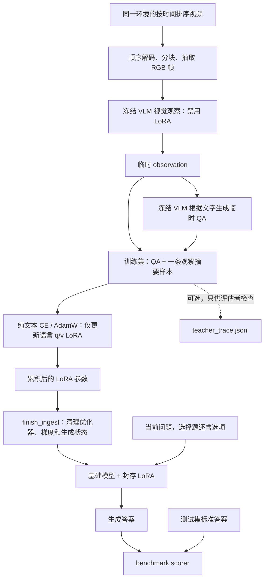
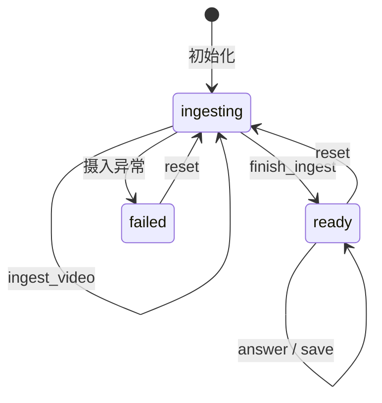

# TTT_frame：当前架构与真实视频评测详解

版本日期：2026-09-11。本文用于项目交接和后续实验设计，内容依据当前源码及已归档的服务器预测、训练日志和审计结果整理；本轮整理文档没有重新训练模型或新增性能实验。

**当前状态：已经能把真实第一人称视频写入 LoRA 参数，并在不输入历史视频或笔记的情况下生成回答。部署成功，但可靠长期记忆尚未得到验证。** SuperMemory 五题中，两档 LoRA 均答对 3/5，盲答为 1/5；EPIC 自由问答仍出现重复及无依据内容。这组实验没有测试搬家后的物品—人物关系保持。

本文依次说明：项目与仓库边界、两条记忆路线、当前视频架构、写入/读取细节、评测协议、实验配置与结果、失败证据、复现方法、归档文件及下一步。

## 1. 研究目标与当前实现的范围

长期目标是研究：**在长时间视频、场景变化和持续干扰下，隐式参数记忆能否保留可查询的物品、人物、位置与交互关系？** 例如，换了住所后，是否仍知道某件物品与某个人的历史关联，同时更新它现在的位置。

当前原型先解决更基础的问题：

1. 能否顺序接收真实视频，将观察内容转化为参数更新？
2. 丢弃模型侧的历史帧和文字后，能否从更新后的模型回答问题？
3. 相比盲答、显式笔记、直接看帧，回答和计算成本有什么变化？

| 能力 | 当前情况 |
|---|---|
| 真实视频输入、顺序分块和抽帧 | 已实现、已在服务器运行 |
| 同一环境内摄入多个视频文件 | 已实现，参数和优化器状态在摄入阶段连续累积 |
| 只更新少量参数 | 已实现，更新语言 decoder 的 q/v LoRA |
| 保存参数后，在新进程回答问题 | 已实现；EPIC 原始 checkpoint 已用于实际读出 |
| MEOWBench 标准协议及计分 | 已接入；本次 25 次选择题作答全部 `ok` |
| 长期事实准确读回 | 尚未证明；当前有重复、无依据回答和目标质量问题 |
| 搬家、跨录制身份跟踪、稳定人物—物品绑定 | 尚未实现专门机制，也未通过本次数据验证 |
| 三维重建目标、关系 gate、RL、长期记忆巩固 | 尚未实现 |
| 已回答后继续在线写入同一个记忆实例 | 当前状态机不支持；封存后要重新写入必须 reset，原记忆会被重置 |

这里的“隐式”指**查询时历史知识的载体是参数**。写入时仍会显式生成临时观察文字和 QA，所以这不是完全绕过语言中间表示的视觉隐式记忆。

## 2. 仓库边界及两条独立路线

### 2.1 两个仓库的职责

```text
MEOW/
├── TTT_frame/                       模型与记忆机制
│   ├── ttt_frame/
│   │   ├── lact.py                  早期 LaCT 向量快速权重
│   │   ├── video.py                 真实视频顺序分块与采样
│   │   └── videoqa.py               当前生成式视频 → LoRA → 问答
│   ├── scripts/exp_scene_change.py  合成场景变化机制实验
│   ├── tests/
│   └── docs/
└── meowbench/                       数据、协议、计分与评估工具
    ├── meowbench/adapters/ttt_lact.py 连接模型的协议桥
    ├── meowbench/adapters/hf_vlm.py   冻结 VLM 的笔记/看帧对照
    ├── scripts/run_ttt_pilot.py       suite 实验入口
    ├── scripts/diagnose_ttt_video.py  单视频读出诊断
    └── scripts/report_ttt_evaluation.py 结果汇总与报告
```

`TTT_frame` 的远端是 `quzitsix/TTT_frame`；`meowbench` 的远端是 `quzitsix/test_1`。训练实现不依赖 benchmark。协议桥从安装好的 `ttt_frame` 包导入模型，评测数据和 scorer 留在 benchmark 仓库。

两者可以装在服务器同一个 `meowbench` conda 环境中。仓库分开不等于需要分开环境。Python 包名是 `ttt_frame`，安装项目名是 `ttt-frame`，Linux 目录名是 `TTT_frame`，注意大小写。

### 2.2 不要把 LaCT 和 LoRA 结果混在一起

| 对比项 | 早期 CLIP/LaCT 路线 | 当前 VideoQA/LoRA 路线 |
|---|---|---|
| 核心代码 | `ttt_frame/lact.py` | `ttt_frame/videoqa.py` |
| 感知/输入表示 | 冻结 CLIP 的图像、文字向量 | 冻结生成式 VLM 观察视频帧 |
| 历史写在哪里 | 外部 SwiGLU MLP 的快速权重 | VLM 语言注意力层的低秩增量参数 |
| 写入方法 | 手写负点积梯度，Muon 可选，行范数归一化 | 临时文字目标上的 assistant-token CE + AdamW |
| 读出 | 向量；旧桥通过选项向量相似度做强制选择 | 语言模型直接生成答案 |
| 当前桥的选择 | 默认 `--backend lact`；旧桥只处理 `mcq5` 强制选择 | 必须指定 `--backend lora`；支持生成式答案 |
| 本次真实视频成绩属于哪条 | 不属于这条 | EPIC 和 SuperMemory 成绩均属于这条 |

LaCT 的核心读函数形如：

$$
f_W(x)=W_1\bigl(\operatorname{SiLU}(W_0x)\odot(W_2x)\bigr).
$$

`write(tokens, values)` 可以显式写入 key→value；省略 `values` 时是自关联写入。早期合成绑定实验会人为提供“物体向量→人物向量”，这并不等同于系统已能从真实视频识别人并发现所有权关系。旧 benchmark 桥的普通视频摄入使用的是自关联写入。

历史实验发现过 CLIP 表征各向异性、读出偏置和中心化敏感性。它们说明旧合成实验不能可靠回答“搬家是否损伤绑定”，但**不能直接当作当前 LoRA 退化的已知原因**。当前 LoRA 路线也没有调用 LaCT 的 Muon 更新或范数恢复，更不能称为 Spatial-TTT 的复现。

源码入口：[LaCT](../ttt_frame/lact.py)、[视频采样](../ttt_frame/video.py)、[VideoQA](../ttt_frame/videoqa.py)、[协议桥](../../meowbench/meowbench/adapters/ttt_lact.py)。

## 3. 当前视频架构总览



图中教师与学生是**同一个基础模型的不同调用模式**，不是两份大型模型常驻显存：

- 教师调用：`disable_adapter()` + `torch.inference_mode()`，只使用原始冻结权重。
- 学生训练：启用 LoRA，并仅允许 LoRA 参数求梯度。
- 正式参数问答：启用封存的 LoRA，不输入历史图像、观察文字或历史 QA。
- 视觉对照：显式输入帧并禁用 LoRA，这是评估分支，不是参数问答路径。

教师始终保持原始模型状态，不会被前一块的 LoRA 更新“带着继续编”。两档 suite 训练日志的 observation、QA 和时间戳已逐块核对，70/70 块完全一致。

### 3.1 哪些参数被更新

代码通过模块名选择语言模型路径下的 `torch.nn.Linear`，只匹配 `q_proj` 和 `v_proj`，排除视觉、connector、projector 等模块。

本次 Qwen3-VL-2B checkpoint 的保存配置列出 56 个目标投影：28 层，每层 q/v 各一个。例如：

```text
model.language_model.layers.0.self_attn.q_proj
model.language_model.layers.0.self_attn.v_proj
...
model.language_model.layers.27.self_attn.q_proj
model.language_model.layers.27.self_attn.v_proj
```

每个目标线性层使用低秩增量：

$$
W_{\text{effective}} = W_{\text{base}} + \frac{\alpha}{r}BA.
$$

其中基础权重固定；A、B 可训练。本次 `r=16`、`alpha=32`，缩放系数为 2。视觉部分、原始语言权重、embedding、输出头及其他投影都没有作为可训练参数更新。

| 项目 | 本次实际值 |
|---|---:|
| 基础 VLM | Qwen3-VL-2B-Instruct |
| 基础权重精度 | bfloat16 |
| LoRA 参数精度 | float32 |
| 可训练参数数目 | 3,211,264 |
| 参数字节数 | 12,845,056 bytes，即 12.25 MiB |
| LoRA dropout / bias | 0 / none |
| attention implementation | sdpa |

12.25 MiB 只是 LoRA 参数大小，不包含基础模型、优化器、激活、当前生成 KV 或框架开销。固定参数大小意味着存储预算不随视频长度增长，不意味着能无损记住任意长的视频。

## 4. 写入阶段：视频怎样变成参数

### 4.1 初始化与重置

`VideoTTTMemory(config)` 加载 processor 和基础模型，创建 PEFT LoRA；代码检查所有可训练参数名都属于 LoRA，并保存初始化参数副本 `_initial`。

`reset()` 恢复初始化 LoRA，清空优化器及统计，进入 `ingesting`。同一环境内多个文件连续摄入；不同环境必须 reset，避免一个环境的历史影响另一个环境。

### 4.2 顺序分块与抽帧

`iter_video_chunks()` 使用 PyAV 顺序解码，不通过 seek 跳到关键帧。时间归一为相对首个解码帧的秒数；无时间戳时才尝试用帧率估算。对非单调时间戳、没有视频流或没有可解码帧的输入显式报错。

设块长为 Δ 秒，每块最多 F 帧，目标采样点为：

$$
t_{c,j}=c\Delta+j\frac{\Delta}{F},\qquad j=0,\ldots,F-1.
$$

顺序解码到不早于目标时刻的帧时采样；实际时间写入日志。帧转为 RGB，用 `thumbnail` 保持宽高比，使长边不超过 `max_side`。这是最多 448 像素长边，并不保证每张图都是 448×448；随后还会经过 VLM 自己的 processor。

本次两种采样预算：

- EPIC：Δ=8，F=4；目标间隔 2 秒，得到 `[0,2,4,6]`、`[8,10,12,14]`、`[16]`。
- suite：Δ=60，F=4；通常取 `[0,15,30,45]`，末尾不足 60 秒时可能少于 4 帧。

迭代器只缓冲当前块的采样图像。`max_chunks=0` 消费完整文件；正数会限制每个文件的块数，只适合明确标注的短预算试跑。完整消费文件仍然是稀疏采样，不等于看过每一帧。

### 4.3 冻结教师生成观察

教师接收当前块的图像、时间戳和观察 prompt。prompt 要求描述物品、可见人物、动作、位置、空间关系与变化，区分拍摄者的手与其他人物，不把持有等同于所有权，不臆造身份和不可见事件。

输出为一段 observation。它是模型生成的描述，**不是经过验证的事实**。本次观察生成最多 512 个新 tokens。

### 4.4 冻结教师再生成 QA

第二次教师调用只看刚才的 observation 文字，生成最多 4 条 JSON QA，不重新看帧。`parse_qa()` 校验数组/字符串、剔除空项、按问题文本去重并限制条数。

这个解析器检查格式，**没有事实核验、语义问答匹配、置信度筛选或人工标签校正**。因此“合法 JSON”不保证训练目标正确。

### 4.5 每块还会加入一条摘要训练样本

无论 QA 是否生成成功，代码都会追加：

```text
question: What was observed in session {session}, segment {segment}?
answer:   当前块的整段 observation
```

所以 `qa_per_chunk=4` 通常意味着 **4 条短 QA + 1 条摘要，共 5 个训练样本**。日志的 `qa_pairs` 只计算自动 QA，不包含这条摘要。QA 解析失败时仍可只训练摘要，记为 `caption_only_chunks`；本次两个 suite 参数组该计数均为 0。

`session` 是第几次调用 `ingest_video`，`segment` 是该文件中的块编号；它们不是跨录像的真实世界统一时间或身份编号。suite 将长历史切成多个文件，因此常见的是 session 增加而 segment=1。

### 4.6 纯文本训练目标与优化

学生不在这些更新步骤中接收图像。它看到的是当前训练问题的聊天模板，监督目标是答案文字。

对样本 i，用户 prompt 和 padding 的 label 设为 -100，只对答案区域的有效 tokens 求自回归交叉熵；同时检查完整对话是否确实保留了相同的 generation prefix，避免标签位置错位。

$$
L_i(\phi)=-\frac{1}{|T_i|}\sum_{t\in T_i}
\log p_{\theta_0,\phi}(a_{i,t}\mid q_i,a_{i,<t}),\qquad
L_c(\phi)=\frac{1}{N_c}\sum_{i=1}^{N_c}L_i(\phi).
$$

θ₀ 为冻结基础权重，φ 为 LoRA 参数，Tᵢ 为有效监督位置，N꜀ 为本块样本数。代码对**样本的平均 loss 再取平均**，不是把长摘要的全部 tokens 与短 QA 的 tokens 混在一起做统一加权。

每个优化步骤：

1. 梯度清零。
2. 依次处理本块所有样本，对 `loss / N_c` 反向传播，累积梯度。
3. 将 LoRA 梯度范数裁剪到 1.0；遇到非有限 loss/梯度直接失败。
4. AdamW 更新一次，`weight_decay=0`。

默认 lr=2e-4；本次比较每块 12 步和 3 步。没有学习率调度、旧样本 replay、保持旧知识的正则目标、外层元训练或 RL。优化器在同一摄入阶段跨块/跨文件保留，结束时才丢弃。

计数示例：EPIC 3 块 × 12 步 = 36 次优化器更新；每块 5 个样本时合计 180 次样本级前向/反向。suite 的 70 块对应 280 条 QA + 70 条摘要；12 步组 840 次更新，3 步组 210 次更新。

### 4.7 损失字段的准确含义

`loss_first` 是本块第 1 个更新步骤计算的平均训练 loss；`loss_last` 是最后一个更新步骤计算的 loss，发生在该步骤的参数更新之前。它不是更新全部结束后重新测量的验证 loss。

一次 `ingest_video` 返回的 `loss_first/loss_last` 对应**这个文件最后一块**，不是全视频的平均损失。要看全部块，需要逐块日志。`qa_pairs` 也不是 benchmark 答对数。

低训练 loss 只能说明对自生成目标的拟合改善，不能证明目标真实、未见问法能读回、较早事实未遗忘或自由生成正确。

## 5. 封存、问答、持久化与生命周期

### 5.1 摄入结束后留下什么

`finish_ingest()` 清理优化器和梯度、进入 eval/ready，清除 Qwen 的临时 `rope_deltas`。

| 内容 | 查询时是否保留在模型侧 |
|---|---|
| 冻结基础模型 | 是，提供已有视觉/语言能力 |
| 更新后的 LoRA | 是，作为本环境的参数记忆 |
| 当前问题/选项、当前生成临时 KV | 仅本次调用使用 |
| 历史帧、caption、QA、历史 KV | 不作为查询输入或检索存储保留 |
| 摄入优化器、梯度 | 清理 |
| 数字统计、配置、初始化 LoRA 副本 | 保留；不是历史事件记录 |
| 可选 teacher 审计文件 | 评估者可以保留在磁盘，模型不回读 |

“不保留历史 KV”不等于语言生成不用 KV：单次生成仍用 `use_cache=True`，只是没有跨调用累积的历史缓存。

### 5.2 三种读取方式

- `answer(question, use_memory=True)`：要求 ready，只有问题和启用的 LoRA。
- `answer(question, use_memory=False)`：同样要求 ready，禁用 LoRA，测冻结模型。
- `answer_with_images(question, images)`：禁用 LoRA并输入指定帧，只供视觉对照；它不是参数记忆读出。

生成使用 greedy decoding，最多 128 个新 tokens。当前未添加重复惩罚。每个问题单独编码、单独生成；查询不会更新 LoRA。

### 5.3 保存与加载

`save(new_directory)` 生成：

```text
memory/
├── adapter.safetensors   LoRA 张量
└── memory.json           格式版本、配置、目标模块列表、基础配置指纹、统计
```

目录必须不存在。checkpoint 不包含历史帧、观察文字、QA、优化器或原始视频路径；配置中的基础模型路径仍会保存。

`load_memory()` 检查格式、基础配置指纹、目标模块、rank/alpha、张量 key/shape 及数值有限性，然后恢复参数并进入 ready。基础配置指纹不是完整权重文件哈希；模型架构相同但基础权重不同，也可能通过配置检查，因此必须使用同一基础 checkpoint。

### 5.4 当前是两阶段评测状态机



加载已有记忆会进入 ready，不能直接追加摄入；reset 会恢复初始化参数，不能当作“继续以前的记忆”。所以当前适合“先读完整历史，再问问题”的 MEOWBench 流程，尚不是可以长期交替观察、交互、写入的在线助手机制。

## 6. MEOWBench 怎样调用模型

### 6.1 suite 与环境组织

`manifest.json`、`envs.jsonl`、`items.jsonl` 是已准备的数据接口。环境列出按顺序排列的视频片段；题目包含问题、选项、原标准答案、证据区间和来源信息。

Runner 持有完整评估材料，但适配器摄入时只把暂存视频路径交给 `VideoTTTMemory.ingest_video`。标准答案与证据标注不进入 learner；问答阶段才把当前问题及其选项传给模型，gold 留给 scorer。

### 6.2 协议生命周期

```text
hello
  → env_begin：reset 参数、绑定 env_id 审计标签
  → ingest × N：顺序处理该环境全部视频
  → ingest_end：封存参数、返回写入统计
  → harness 撤销 memory 模式的暂存视频
  → query × M：格式化问题 → 参数问答 → 返回 raw answer
  → scorer 与标准答案比较
  → env_end：再次 reset
```

桥的 `build_prompt()` 负责问题格式，选择题附选项和单选输出要求；`parse_reply()` 保留原始答案并路由字段，字母解析/评分由统一 scorer 处理。日志与协议输出分离。

暂存的 memory 视频是可撤销副本，不是原数据的可写硬链接；撤销采用 truncate-then-unlink。Oracle 模式按定义保留可用视觉输入。超时/进程崩溃、迟到回复和评分分母仍由通用 harness 处理，模型实现不应改写这些规则。

本次参数组和笔记组的 `enforcement=revoked`、`revocation_contested=false`；句柄审计可用，未报告持有媒体句柄。这支持当前实现遵循两阶段协议，不是针对恶意系统的完整安全隔离证明。

### 6.3 六个容易混淆的实验标签

| 标签 | 摄入阶段 | 问答阶段 | 本次在哪运行 |
|---|---|---|---|
| blind | 无视频、无更新 | 初始化模型/LoRA，没有本环境历史 | SuperMemory |
| memory，12 步 | 视频 → LoRA 自蒸馏 | 只有问题与参数 | SuperMemory；EPIC 原参数 |
| memory，3 步 | 相同目标、更少更新 | 只有问题与参数 | SuperMemory；EPIC 重训 |
| base-read | 已有/已训练 LoRA | 临时禁用 LoRA | EPIC；脚本支持 suite，但本轮 suite 未另跑此组 |
| notes | 冻结 VLM 生成显式笔记 | 问题 + 笔记 | SuperMemory |
| oracle / visual | 保留或重新取得采样帧 | 问题 + 显式帧，冻结模型 | SuperMemory oracle；EPIC visual |

blind 分配了初始化 LoRA，但写入次数为零；不要因 `memory_bytes` 非零把它当成有历史的记忆组。参数模式的 `n_records=0` 则表示没有显式记录，不能反过来断言没有参数写入。

两个 LoRA suite 组使用相同 teacher 目标；notes 的笔记 prompt 与 LoRA 教师目标不同。再加上采样时刻不同，notes/oracle 与 LoRA 的比较用于诊断，不是只替换一个记忆模块的完全同输入消融。

## 7. 本次评测的配置、版本与数据

### 7.1 运行环境与可复现版本

| 项目 | 实际记录 |
|---|---|
| 基础模型目录 | `/data/quzitsix/models/Qwen3-VL-2B-Instruct` |
| Python 环境 | `/home/quzitsix/miniconda3/envs/meowbench/bin/python` |
| PyTorch / Transformers | 2.9.1 / 4.57.6 |
| PEFT / PyAV / Accelerate | 0.20.0 / 18.1.0 / 1.14.0 |
| 服务器 GPU 报告 | 8 张 NVIDIA GeForce RTX 4090 D，`memory.total` 每张 49,140 MiB |
| 实验任务分配 | GPU 0：12 步；GPU 1：3 步；GPU 2：依次运行三个 suite 对照；GPU 3：EPIC 诊断 |
| 模型代码 commit | `95368e47f96a5293089ed8d42af320ea3d020d1a` |
| 实验启动时 benchmark commit | `43b07ba40207d71760ad1fe211a22a0575931b9f` |
| 汇总报告代码 commit | `edc67bfc977911f603a298179e69ae8991b67300` |

版本来自 `code_versions.json` 和 `runtime_snapshot.json`。实验启动版本与后来整理报告的版本分开记录，不能把文档提交号当作运行模型的提交号。GPU 型号和总量按服务器实际输出记载；旧详细报告中“48,501 MiB”的总量表述已更正为 49,140 MiB。

### 7.2 实际参数，而非仅列代码默认值

| 参数 | EPIC 原记忆 | EPIC 少步重训 | EPIC 低学习率重训 | SuperMemory 两个参数组 |
|---|---:|---:|---:|---:|
| `chunk_seconds` | 8 | 8 | 8 | 60 |
| `frames_per_chunk` | 4 | 4 | 4 | 4 |
| `max_side` | 448 | 448 | 448 | 448 |
| `steps_per_chunk` | 12 | 3 | 12 | 12 / 3 |
| `learning_rate` | 0.0002 | 0.0002 | 0.00005 | 0.0002 |
| `qa_per_chunk` | 4 | 4 | 4 | 4 |
| `teacher_max_new_tokens` | 512 | 512 | 512 | 512 |
| `max_new_tokens` | 128 | 128 | 128 | 128 |
| `max_length` | 1024 | 1024 | 1024 | 1024 |
| LoRA rank / alpha | 16 / 32 | 16 / 32 | 16 / 32 | 16 / 32 |
| seed | 0 | 0 | 0 | 0 |
| `max_chunks` | 0，不限块数 | 0 | 0 | 0 |
| gradient checkpointing | 关闭 | 关闭 | 关闭 | 关闭 |

当前代码的块长默认是 30 秒、teacher 默认生成上限是 256 tokens；本表实验显式覆盖成上述值。复现实验不能只用默认参数。`max_length=1024` 是学生训练文本的截断预算；不是一段视频总共可写多少 tokens，也不是查询阶段的输出预算。

### 7.3 SuperMemory pilot 的实际规模

使用已整理的 `/data/quzitsix/meow-releases/supermemory-pilot-v2`，保留原题、原选项顺序和标准答案。本轮只含 5 道四选一题，每道题对应一个截至提问时刻的历史环境。全部标注为可回答题，不是完整数据集评测。

suite 的预处理记录为：按 60 秒切片、视频重采样到 2 fps、长边最多 768 像素；TTT 随后仍只从每块取最多 4 帧，并缩到长边 448。数据预处理的 2 fps 不等于模型实际观察 2 fps。当前输入没有音频、转录、视线或三维几何。

| 题号 | 类型 | 历史文件数 | 历史累计时长（秒） | 标准答案 |
|---|---|---:|---:|---|
| supermemory-9 | 物体位置 | 18 | 1080 | A |
| supermemory-14 | 视觉回忆 | 11 | 658 | D |
| supermemory-15 | 时间线 | 14 | 840 | C |
| supermemory-19 | 视觉回忆 | 9 | 506 | D |
| supermemory-204 | 时间线 | 18 | 1040 | C |
| 合计 | 5 个环境，各 1 题 | 70 | 4124 | — |

4124 秒约为 68.73 分钟，是**五段历史前缀时长之和**。环境之间存在重叠，去重后只有 38 个媒体路径；不能宣传成 68.73 分钟互不重叠的新视频。审计中的 `cross_recording_items=0`，本轮没有跨录制的问题，更没有明确的搬家前后配对实验。

每个环境都重新初始化记忆，再摄入自己的完整前缀；不会把前一道题的参数直接用于下一道题。四个选项中包含题目指定的弃答选项，其位置随题变化。正式评分采用单个选项字母的精确匹配，不计算开放式语义正确率，也不宣称复现了原数据集的所有官方指标。

题目沿用官方标准答案，尚未独立人工复审，元数据的 `audit.status=pending` 表示这个复审状态；它与评分器的“开放题等待判分”不同，本次选择题的 `n_pending_judge=0`。例如 Q9 的 C 选项是较宽泛的“厨房内的处理容器”，与具体正确选项 A 的语义有重叠，本轮仍严格按原答案 A 计分，不自行改标签。

suite 指纹：

```text
399d60edf1ce7e31964b5a9353644d90e11da35fccae1c074513735cdfa38e26
```

## 8. SuperMemory：有标准答案的评测结果

### 8.1 总体结果

| 组别 | 正确数 | 准确率 | 弃答数 | 运行错误 | pending | 重复输出启发式 |
|---|---:|---:|---:|---:|---:|---:|
| blind | 1/5 | 20% | 0 | 0 | 0 | 0/5 |
| LoRA，12 步/块 | 3/5 | 60% | 0 | 0 | 0 | 0/5 |
| LoRA，3 步/块 | 3/5 | 60% | 0 | 0 | 0 | 0/5 |
| 显式 notes | 2/5 | 40% | 1 | 0 | 0 | 0/5 |
| 冻结 oracle 看帧 | 1/5 | 20% | 0 | 0 | 0 | 0/5 |

25 次作答全部完成且状态为 `ok`。弃答选项在这些可回答题中仍按错误计入分母。选择题输出很短，未触发重复规则并不能说明模型的自由生成能力正常。

两个 LoRA 组相对 blind 都多答对两道题，即 **+40 个百分点**。这只是本次五题的描述统计；只有一个 seed，历史又有重叠，不能由此宣布显著改善、泛化到长期视频或超越显式记忆。四选一均匀随机机会水平为 25%，但模型本身不是均匀随机作答器。

### 8.2 逐题结果

下表保留原选项字母；括号标记是否正确，便于检查总分相同是否意味着行为相同。

| 题号 | gold | blind | 12 步 | 3 步 | notes | oracle |
|---|---|---|---|---|---|---|
| Q9 | A | C × | C × | A ✓ | C × | C × |
| Q14 | D | C × | D ✓ | C × | C × | C × |
| Q15 | C | B × | C ✓ | C ✓ | C ✓ | C ✓ |
| Q19 | D | C × | A × | C × | B ×，弃答 | A × |
| Q204 | C | C ✓ | C ✓ | C ✓ | C ✓ | B × |

两档 LoRA 的正确集合不同：12 步答对 Q14，3 步答对 Q9。Q204 连 blind 都答对，不能独立用来证明模型记住了视频。五道 gold 中两道为 C、两道为 D；多组频繁输出 C，恒选 C 就可得 2/5。后续需要选项重排和无选项问答控制，排除格式或答案先验影响。

### 8.3 按类型拆分

| 类型 | 题数 | blind | 12 步 | 3 步 | notes | oracle |
|---|---:|---:|---:|---:|---:|---:|
| 物体位置 | 1 | 0/1 | 0/1 | 1/1 | 0/1 | 0/1 |
| 视觉回忆 | 2 | 0/2 | 1/2 | 0/2 | 0/2 | 0/2 |
| 时间线 | 2 | 1/2 | 2/2 | 2/2 | 2/2 | 1/2 |

每类仅一至两题，这张表用于定位案例，不是稳定的能力排名。

### 8.4 写入成本与查询延迟

| 组别 | 总摄入时间（秒） | 查询 P50 / P95（毫秒） | 摄入帧数 | 报告的最大记忆字节数 |
|---|---:|---:|---:|---:|
| blind | 0.17 | 65 / 490 | 0 | 12,845,056 |
| 12 步 | 1650.96（27.52 分钟） | 53 / 62 | 276 | 12,845,056 |
| 3 步 | 1403.30（23.39 分钟） | 55 / 65 | 276 | 12,845,056 |
| notes | 1321.78（22.03 分钟） | 299 / 406 | 280 | 43,783 |
| oracle | 11.28 | 179,019 / 234,474 | 280 | 0，未计帧字节 |

解释这些数字时需要保持相同口径：

- 摄入时间是五个环境之和，不是一个环境，也不是全部任务并行结束的墙钟时长。
- 查询是模型已驻留时的请求耗时；LoRA 这里通常只生成一个选项字母，不能把约 53 ms 当作开放式视频回答的延迟。
- oracle 把视觉计算放在查询阶段。它的 `memory_bytes=0` 不包含显式帧实际占用，绝不代表零内存；notes 的文字字节数也不是其总显存。
- 每环境最大 LoRA 参数为 12.25 MiB。把五个环境的参数字节相加，不代表模型同时保留了五段历史。
- 每组只有五次查询，没有统一预热或严格性能隔离。并行 GPU 任务、首问开销和视觉输入长度都会影响耗时。oracle 的长查询没有完整阶段计时，不能直接给出架构加速倍率。

两个 LoRA 组均摄入 70 块、276 帧，生成 280 条 QA，额外加 70 条摘要，即 350 个临时训练样本。12 步组总计 840 次 optimizer step，3 步组为 210 次；两者 `caption_only_chunks=0`、`truncated_examples=0`、`sampling_capped=false`。

将更新步数减少 75%，总摄入时间只减少约 15.0%。观察/QA 生成、解码等固定开销仍存在，但本次没有逐阶段耗时分解，不能进一步断言某一项独占多少时间。两个参数组记录到的摄入峰值 CUDA allocated 均约 **6.26 GiB**；这不包含 CUDA reserved 与其他进程占用。

### 8.5 证据是否真的进入了采样帧

评估完成后，将实际 TTT 采样时间与题目的证据时间段交叉检查。该审计没有用于改变训练或挑选帧。

| 题号 | 至少有一个采样时刻命中的证据段 / 总证据段 | 主要发现 |
|---|---:|---|
| Q9 | 1/1 | 命中 15 秒 |
| Q14 | 1/1 | 命中 0、15 秒 |
| Q15 | 4/5 | 某片段 54–60 秒的证据区间没有采样帧 |
| Q19 | 3/3 | 各证据区间均有时间点命中 |
| Q204 | 1/2 | 最后片段证据在 5–13 秒，实际取 0、15 秒，未命中 |

命中时间区间只表示帧时间落在区间中，不能保证目标可见、分辨率足够或文字被正确识别。反过来，漏掉部分证据后仍猜对选项，也不能视为该证据已被记住。

Q14 是一个值得复查的例子：12 步组答对，但其环境的 observation/QA 文本中，对 `lentil`、`soak`、`hour`、`overnight` 的关键词扫描均未命中。这只是有限的文字检查，不足以证明所有同义表达都不存在；它足以提醒我们，**答对选项与可审计的事实读回不是同一个结论**。

### 8.6 对照的公平性边界

TTT 每块从起点采样；HF notes/oracle 使用 session 内区间中点采样，因此总帧数是 276 对 280，帧内容也不同。oracle 总帧上限为 96，本次单环境实际最多 72 帧，未触发该上限，但它仍只是稀疏采样视觉对照。notes 的观察 prompt 与 LoRA 的 teacher 目标也不相同。

因此，目前不能依据 60% 对 40% 或 20% 宣称参数记忆胜过文本存储/视觉输入。下一轮若研究“存在哪里”的作用，应先缓存同一套非 gold 教师目标，将相同内容分别交给参数记忆和文本记忆。

## 9. EPIC：单视频参数读出的详细诊断

### 9.1 视频与原始运行

输入是 `P07_106.MP4`：视频流时长约 16.2 秒，容器时长约 16.213 秒，1920×1080、50 fps，共 810 帧，文件 47,917,136 bytes。它是现实厨房的第一人称片段，不是带文字标签的合成绑定图。

原始记忆保存于服务器 `/home/quzitsix/TTT_frame/memories/video_test_01`。按 8 秒一块、每块 4 帧，实际写入 3 块、9 帧、12 条 QA 和 3 条摘要；总计 36 次优化器更新。

| 块 | 帧数 | 自动 QA | 原运行 loss_first → loss_last |
|---|---:|---:|---:|
| 1 | 4 | 4 | 2.8922 → 0.5915 |
| 2 | 4 | 4 | 2.8638 → 0.2178 |
| 3 | 1 | 4 | 2.8088 → 0.4019 |

原用户日志记录摄入耗时 **51.95 秒**，峰值 CUDA allocated 为 **5,752,859,648 bytes，约 5.36 GiB**，LoRA 仍为 12.25 MiB。这里引用原训练日志；不能把后来加载 checkpoint 的新进程峰值当作原训练峰值。

主问题 `What objects were visible, and where were they?` 的参数回答反复输出 `a black coffee pot on a black coffee pot`。禁用 LoRA 时，同一问题得到“没有视觉输入、无法了解当前环境”的拒答式回复。原始观察到的事实是：参数更新改变了回答行为，但没有产生可靠的场景描述。

### 9.2 两个重训变体

诊断固定基础模型、视频、采样、rank 和 prompt，另从初始化参数重训少步与低学习率版本；不是对原记忆再微调。

| 参数版本 | 每块步数 | 学习率 | 总更新数 | 摄入秒数 | 三块训练 loss_first → loss_last |
|---|---:|---:|---:|---:|---|
| saved，原记忆 | 12 | 2e-4 | 36 | 51.95 | 2.8922→0.5915；2.8638→0.2178；2.8088→0.4019 |
| steps3，重训 | 3 | 2e-4 | 9 | 44.14 | 2.8922→2.2406；3.7351→2.4786；1.6751→1.5109 |
| lr5e5，重训 | 12 | 5e-5 | 36 | 52.37 | 2.8922→1.8434；3.4370→1.7675；1.8232→1.3618 |

每块初始 loss 不同，因为前面块的参数状态已经不同；它们不是在同一学生状态上测出的独立样本难度。表中的最后 loss 仍是最后一次更新前的训练 loss，不是泛化误差。

### 9.3 117 次输出的探针设计

每个参数版本运行 13 个问题，每题使用三种读取方式：memory、base-read、visual。因此每版 39 次，三版合计 **117 次输出**。

13 个问题分成：

1. 8 个自由视频问题：总览、改写、物品、动作、外观、动作顺序、最终位置、其他人物。
2. 3 个摘要模板问题：分别问 session 1 的 segment 1、2、3，与训练摘要问题格式相同。
3. 2 个独立指令控制：`2 + 3` 只输出 `5`；精确复制 `blue triangle`。

前 11 题没有独立人工标准答案，所以只做退化和案例诊断，**没有视频 QA 准确率**。三个训练模板问题也不能算未见过的问题泛化。visual 给模型全部 9 张采样帧；它不是人工答案，也不能据此认定模型正确理解了 segment 编号。

### 9.4 重复、拒答与指令保持

| 参数版本 | 读取方式 | 自由题重复 / 8 | 训练模板重复 / 3 | 文字拒答 / 11 | 指令控制正确 / 2 |
|---|---|---:|---:|---:|---:|
| saved | memory | 2/8 | 2/3 | 0/11 | 2/2 |
| saved | base-read | 0/8 | 0/3 | 3/11 | 2/2 |
| saved | visual | 1/8 | 0/3 | 0/11 | 2/2 |
| steps3 | memory | 2/8 | 0/3 | 0/11 | 2/2 |
| steps3 | base-read | 0/8 | 0/3 | 3/11 | 2/2 |
| steps3 | visual | 1/8 | 0/3 | 0/11 | 2/2 |
| lr5e5 | memory | 1/8 | 1/3 | 0/11 | 2/2 |
| lr5e5 | base-read | 0/8 | 0/3 | 3/11 | 2/2 |
| lr5e5 | visual | 1/8 | 0/3 | 0/11 | 2/2 |

base-read 和 visual 的冻结模型输出在三版之间已核对为相同。这说明本轮这些对照的变化没有混入参数版本比较。

重复启发式先做近似分词：英文词/数字，以及单个汉字；对 4-gram 计算 `1 - unique_count / total_count`。输出长度至少 20 个词/字、重复比例至少 0.4，并且某个 4-gram 至少出现 3 次，才标记为重复。拒答使用固定短语规则。

这些规则会漏掉短重复，也可能把正常枚举标记出来，不是事实正确率。两项简单指令均保留，只能说明没有在这两个控制上失败，不能据此宣称一般能力无损。

### 9.5 主问题与视觉/教师检查

| 版本/读取 | 主问题的实际表现 | 可支持的判断 |
|---|---|---|
| saved / memory | 反复说黑色咖啡壶位于黑色咖啡壶上 | 明显生成退化 |
| steps3 / memory | 反复枚举白色塑料袋 | 少步没有修复主问题读出 |
| lr5e5 / memory | 流畅描述红、蓝、绿球分别位于房间各处 | 不重复仍可能无依据；采样帧不支持这个描述 |
| base-read | 主问题声明缺少视觉输入 | 一个合理的无上下文反应；其他探针仍有编造，不能说基础模型全部忠实 |
| visual | 能提到厨房水槽和台面，但其他问题仍有重复/细节错误 | 看帧改善了部分内容，感知对照也不完美 |

本地已查看九张实际采样帧的拼图：可见厨房水槽、台面、手及水龙头附近的黑色带柄容器。图像没有支持低学习率主答案中的三种彩球场景。该检查只覆盖实际采样帧，不冒充完整原视频逐帧标注。

实际重训 `teacher_trace.jsonl` 中还发现两类目标质量问题：

- QA 问 `What is the liquid in the sink being stirred with?`，答案却是 `A dark liquid`，没有回答“用什么搅拌”。格式正确不等于语义配对正确。
- 观察文字把黄色手套描述成正在穿戴；采样帧显示裸手以及放在水槽内的手套。把错误观察蒸馏进参数，只会让训练更拟合错误目标。

两个 SuperMemory 参数组各有 19/70 条 teacher observation 触发重复启发式。这个数字不是“19 条事实错误”，但提示目标文本需要单独质检。

**注意文件语义：** `observations.json` 是诊断期间再次调用冻结模型生成的观察，使用诊断生成预算，不能自动视为当初训练过的原始目标。追溯实际训练请读对应 `teacher_trace.jsonl`。原始 saved 记忆在加入 trace 功能前生成，没有完整的原训练 teacher trace；两个重训变体才有实际写入目标日志。

## 10. 早期 CLIP/LaCT 场景变化实验：保留哪些结论

这部分是历史实验，与第 8、9 节的 LoRA 真实视频结果分开。数据来自已报告的服务器终端结果，没有在本次文档整理中重新运行。

实验人为建立 4 个物体—人物向量绑定，在 A 场景写入，然后加入若干 filler 写入。最终改变物体查询图的场景，并通过人物候选向量读出绑定。每个单元 30 trials，机会水平 0.25；CLIP ViT-B/32，开启中心化，`head_dim=64`、`base_lr=0.05`、Muon 开启。

只看 SAME 与 MOVED 对角线时，搬家组甚至更好。但完整交叉实验表明，“干扰来自哪个家”和“查询在哪个家”是两个不同因素：

| filler 写入数 | filler A → query A | filler A → query B | filler B → query A | filler B → query B |
|---:|---:|---:|---:|---:|
| 8 | 0.933 ± 0.040 | 0.392 ± 0.045 | 0.983 ± 0.023 | 0.967 ± 0.031 |
| 16 | 0.625 ± 0.045 | 0.342 ± 0.044 | 0.867 ± 0.051 | 0.833 ± 0.059 |
| 32 | 0.392 ± 0.045 | 0.250 ± 0.000 | 0.617 ± 0.069 | 0.583 ± 0.086 |

`±` 沿用该脚本终端报告的误差量；它不是本次五题评测的置信区间。单元格里的绑定试次不等于独立真实家庭。

| filler 数 | filler 主效应 B−A | query 主效应 B−A | 对角线 SAME−MOVED |
|---:|---:|---:|---:|
| 8 | +0.312 | −0.279 | −0.033 |
| 16 | +0.367 | −0.158 | −0.208 |
| 32 | +0.279 | −0.087 | −0.192 |

可以保留的结论是：在这个特定合成设置下，干扰背景与查询背景作用不同，对角线比较存在混杂。不能从“MOVED 高于 SAME”推断真实搬家有利，也不能把这些数字当作模型已经从第一人称视频学会了人物身份和物品归属。

早期未中心化实验还暴露过 CLIP 向量公共方向及读出塌缩问题，推动了中心化和更完整对照的加入。这一经验对当前项目的启发是**分别审计感知、写入和读出**；不是把某个旧表征修正直接套在 LoRA 上就能解决现在的重复。

## 11. 到目前为止，究竟验证了什么

| 判断 | 证据强度与范围 |
|---|---|
| 工程链路可用 | 已支持：视频摄入、纯参数保存/加载、生成式查询、benchmark 协议、原始产物导出 |
| 参数确实接受了更新 | 已支持：仅 LoRA 可训练、存在优化器更新与 loss 变化，开关 adapter 改变回答 |
| 只凭参数可以产生视频相关答案 | 有实例，但内容不稳定，不能等同于正确恢复历史事实 |
| 当前小 suite 存在分数增益 | 已观察：两档均 3/5，blind 为 1/5；样本少且存在选项/采样混杂 |
| 少步或低学习率修复了自由读出 | 不支持：主问题仍重复或无依据；重复数下降不等于正确率提高 |
| 训练 loss 下降证明记忆成功 | 不支持：这是对临时教师目标的拟合，尚缺独立事实检验 |
| 原始 VLM 感知足够好 | 不支持：看帧与 teacher 都出现内容错误 |
| 长期记忆容量、抗遗忘、搬家后的关系保持 | 本轮未测；不能宣称已经解决 |
| 模型一般能力未损伤 | 只通过两个简单指令控制，证据不足以覆盖一般能力 |

目前能定位到两个实际问题：上游目标有噪声，下游参数自由生成有退化。尚未完成受控实验来区分：事实没有被观察、没有被正确写入、后续写入覆盖、问题无法寻址，或生成过程失稳。不要把全部失败预先归因为“灾难性遗忘”，也不要只通过重复惩罚让文本变流畅后就宣布修复。

## 12. 使用与复现

以下为服务器 Bash 命令，使用已验证的 `meowbench` conda 环境。每次写入和评测使用新输出目录，保留原始产物。路径按本次服务器布局填写。

### 12.1 环境与目录

```bash
conda activate meowbench
export TTT_DIR=/home/quzitsix/TTT_frame
export BENCH_DIR=/home/quzitsix/meowbench
export MODEL=/data/quzitsix/models/Qwen3-VL-2B-Instruct
export VIDEO=/home/quzitsix/data/epic/videos/P07_106.MP4
export SUITE=/data/quzitsix/meow-releases/supermemory-pilot-v2
export HF_HUB_OFFLINE=1
export OMP_NUM_THREADS=4
export MKL_NUM_THREADS=4
```

两个包应已以 editable 模式安装进同一环境；不必另建 conda。若换了一台尚未安装的服务器，按两个仓库各自安装说明安装依赖和本地包。基础模型目录需要完整的模型权重、config、tokenizer、processor 文件；离线开关不会替你补齐缺失文件。

数据仍由 MEOWBench 准备。suite 的媒体路径必须在服务器可读；不需要把数据复制进 `TTT_frame`，也不需要在后者重新组织 benchmark。直接单视频试用只需视频文件，不需要 suite。

### 12.2 单独写入、保存和问答

```bash
cd "$TTT_DIR"
MEMORY="$TTT_DIR/memories/epic_$(date +%Y%m%d_%H%M%S)"

python -m ttt_frame.videoqa ingest \
  --model-path "$MODEL" --local-files-only \
  --video "$VIDEO" --device cuda:0 --dtype bfloat16 \
  --chunk-seconds 8 --frames-per-chunk 4 --max-side 448 \
  --steps-per-chunk 12 --learning-rate 0.0002 --qa-per-chunk 4 \
  --teacher-max-new-tokens 512 --save "$MEMORY"

QUESTION="What objects were visible, and where were they?"
python -m ttt_frame.videoqa ask \
  --memory "$MEMORY" --model-path "$MODEL" --local-files-only \
  --question "$QUESTION"

python -m ttt_frame.videoqa ask \
  --memory "$MEMORY" --model-path "$MODEL" --local-files-only \
  --without-memory --question "$QUESTION"
```

这里生成回答时不传 `--video`。第二个 ask 禁用 LoRA，作为相同问题的基础模型对照。每次 CLI 都重新加载基础模型，终端整条命令耗时与第 8 节驻留进程的单题延迟不同。

编程接口适合连续摄入多个文件后一次封存：

```python
from ttt_frame.videoqa import VideoTTTConfig, VideoTTTMemory

cfg = VideoTTTConfig(
    model_path="/data/quzitsix/models/Qwen3-VL-2B-Instruct",
    local_files_only=True,
    device="cuda:0",
    dtype="bfloat16",
    chunk_seconds=8,
    frames_per_chunk=4,
    steps_per_chunk=12,
    teacher_max_new_tokens=512,
)
memory = VideoTTTMemory(cfg)
memory.ingest_video("/path/to/first.mp4")
memory.ingest_video("/path/to/second.mp4")
memory.finish_ingest()
answer = memory.answer("What happened before the second recording?")
memory.save("/path/to/new_memory_directory")
```

此示例只展示接口，并不保证模型能正确回答这个跨文件问题。`finish_ingest()` 之后继续 `ingest_video()` 会被拒绝；不要用 reset 假装追加历史。

### 12.3 正式 suite 五组复现

以下顺序运行，GPU 需求比本次并行作业简单；精度结果是同配置复跑，耗时不能期待逐秒相同。`--limit 0` 才表示整套题，`--max-chunks 0` 表示完整处理每个视频文件。

```bash
cd "$BENCH_DIR"
OUT="$BENCH_DIR/runs/ttt_rerun_$(date +%Y%m%d_%H%M%S)"
export CUDA_VISIBLE_DEVICES=0

COMMON=(
  --suite "$SUITE" --model-path "$MODEL" --local-files-only
  --limit 0 --max-chunks 0 --device cuda:0 --dtype bfloat16
  --chunk-seconds 60 --frames-per-chunk 4 --max-side 448
  --qa-per-chunk 4 --teacher-max-new-tokens 512 --trace-teacher
)

python scripts/run_ttt_pilot.py "${COMMON[@]}" \
  --out "$OUT/suite_steps12" --arms memory --steps-per-chunk 12

python scripts/run_ttt_pilot.py "${COMMON[@]}" \
  --out "$OUT/suite_steps3" --arms memory --steps-per-chunk 3

python scripts/run_ttt_pilot.py "${COMMON[@]}" \
  --out "$OUT/suite_controls" --arms blind notes oracle
```

脚本内部为 LoRA 指定 `--backend lora`，对每个环境 reset，并统一处理隔离和计分。`--trace-teacher` 留下可审计目标文本，但文本不回流进入 query。遇到错误应查看原始日志，不能删除失败行后重新计算准确率。

若只想先检查新 suite 的兼容性，可用另一个输出目录加 `--limit 1 --arms blind memory`。这个短试跑必须标注为一题，不能混进全量结果。直接调用旧 `meowbench.adapters.ttt_lact` 时若忘记 backend，会走早期 LaCT 路线。

### 12.4 单视频三版本诊断

诊断脚本要求可读的视频和已有 `memory.json`；saved 分支还需原 `adapter.safetensors`。脚本读取 checkpoint 内的模型路径，固定使用可见 GPU 的 `cuda:0`；可通过 `CUDA_VISIBLE_DEVICES` 指定物理卡。本脚本用于短片，最多收集 64 个采样帧。

```bash
cd "$BENCH_DIR"
SAVED="$TTT_DIR/memories/video_test_01"
DIAG="$BENCH_DIR/runs/epic_diagnose_$(date +%Y%m%d_%H%M%S)"

python scripts/diagnose_ttt_video.py \
  --video "$VIDEO" --memory "$SAVED" --out "$DIAG/epic_saved"

python scripts/diagnose_ttt_video.py \
  --video "$VIDEO" --memory "$SAVED" --out "$DIAG/epic_steps3" \
  --retrain-steps 3

python scripts/diagnose_ttt_video.py \
  --video "$VIDEO" --memory "$SAVED" --out "$DIAG/epic_lr5e5" \
  --retrain-steps 12 --learning-rate 0.00005
```

前一条只读原记忆，后两条从新初始化开始训练。三个训练模板探针是针对当前三块 EPIC 片段预设的；换成长视频时，应重新设计固定、独立的诊断问题，不能直接套用其分母和语义。

### 12.5 用现有结果重新生成报告，不消耗 GPU

```bash
cd "$BENCH_DIR"
ROOT="$BENCH_DIR/runs/ttt_detailed_20260911"

python scripts/report_ttt_evaluation.py \
  --runs \
    "blind=$ROOT/suite_controls/blind" \
    "steps12=$ROOT/suite_steps12/memory" \
    "steps3=$ROOT/suite_steps3/memory" \
    "notes=$ROOT/suite_controls/notes" \
    "oracle=$ROOT/suite_controls/oracle" \
  --diagnostics \
    "saved=$ROOT/epic_saved" \
    "steps3=$ROOT/epic_steps3" \
    "lr5e5=$ROOT/epic_lr5e5" \
  --out "$ROOT/report_rebuilt_$(date +%Y%m%d_%H%M%S)"
```

这只读取归档预测和日志，输出 Markdown、HTML 与 `detailed.json`，不重新执行模型。本文件还加入了源码解释、证据审计和历史实验背景，比自动报告覆盖更广。

## 13. 产物目录与证据追溯

### 13.1 已经具备的材料

服务器目录：`/home/quzitsix/meowbench/runs/ttt_detailed_20260911`。

本地目录：`F:\desktop\阿峰THU文件\MEOW\meowbench\runs\ttt_detailed_20260911`。本地已取得结构化产物和九帧拼图，足够编写与复核本文，**现在不需要用户额外打包**。

```text
ttt_detailed_20260911/
├── code_versions.json / runtime_snapshot.json
├── jobs.json / *.log
├── input_metadata/
│   ├── manifest.json / envs.jsonl / items.jsonl
│   └── media_index.json / source_plan.json
├── suite_steps12/memory/
├── suite_steps3/memory/
├── suite_controls/{blind,notes,oracle}/
│   └── 各组 predictions.jsonl、report.json、summary.json 等
├── epic_saved/
├── epic_steps3/
├── epic_lr5e5/
│   └── 各版 probes.jsonl、diagnostic.json、observations.json 等
├── epic_sampled_frames.jpg
├── audit.json / audit_artifacts.py
├── report/{report.md,report.html,detailed.json}
└── artifacts.zip
```

本地归档未包含原始 EPIC 视频、LoRA 权重二进制和结果数据库；这些不影响当前基于预测日志的统计检查，但本地无法仅凭此压缩包重新加载原参数或重训视频。

### 13.2 文件应该怎么读

| 文件 | 用途与限制 |
|---|---|
| `predictions.jsonl` | suite 逐题原始输出、标准答案、状态与耗时；重算分数的主要依据 |
| `report.json` / `summary.json` | 单组汇总、协议和摄入统计 |
| `pilot.json` | suite 指纹、题目列表、CLI 对应配置及帧采样说明 |
| `ttt_metrics.jsonl` | 模型摄入统计；区分参数大小、帧数、步数和峰值分配 |
| `teacher_trace.jsonl` | 实际临时训练目标及块级 loss；评估者审计材料，不是模型查询数据库 |
| `probes.jsonl` | 单视频 13×3 输出；只有两个指令控制有可自动判定的 gold |
| `diagnostic.json` | 参数版本、源视频/记忆、是否重训、配置与统计 |
| `observations.json` | 诊断期间重新生成的看帧观察，不能替代原训练 trace |
| `memory/memory.json` | 重训 checkpoint 元数据；没有二进制权重不能恢复参数 |
| `audit.json` | 行数/状态、teacher 一致性、冻结输出一致性、证据时间覆盖、文件哈希 |
| `input_metadata/*` | 实际 suite 的定义快照；其中服务器媒体路径在本地未必可读 |
| `runtime_snapshot.json` | 包版本、GPU 报告、基础 config 与原视频哈希；不是完整模型权重清单 |

本地快捷入口：[自动报告](../../meowbench/runs/ttt_detailed_20260911/report/report.md)、[结构化汇总](../../meowbench/runs/ttt_detailed_20260911/report/detailed.json)、[审计](../../meowbench/runs/ttt_detailed_20260911/audit.json)、[运行环境](../../meowbench/runs/ttt_detailed_20260911/runtime_snapshot.json)、[EPIC 九帧拼图](../../meowbench/runs/ttt_detailed_20260911/epic_sampled_frames.jpg)。这些相对链接适用于两个仓库并列且已下载归档的本地目录；单独克隆 Git 仓库不会自动包含被忽略的 `runs/` 产物。

校验记录：

```text
artifacts.zip SHA256
d33796c0ecfa1039e3a3005e351f691745da4cbe993cf971ec0fdee854f6b87c

原始 EPIC 视频 SHA256（服务器计算）
d8702319579c9ecf7ca8f83b668cdd677feae1ab8cf7f730806811af135a2f6e

基础模型 config SHA256（不是完整权重哈希）
bec4b3d446efa05807365c9e1cec03ac590836879d02f3a6da879971154bdd3b
```

如果后续转交到无法访问当前目录的另一台机器，优先传这个小型评测包即可复核已报告结果。只有继续做逐帧事实标注、检查解码问题或复现参数读出时，才分别需要原视频/额外采样帧、完整 checkpoint，以及可用的同版本基础模型。

相关现有文档：[简报](REPORT_20260911_BRIEF.md)、[真实视频实验报告](REPORT_20260911_REAL_VIDEO.md)。本详解以当前代码和归档为准，历史报告中的计划不应当作已完成实验。

## 14. 下一阶段建议：先证明可读回，再测试搬家

### 14.1 优先做一个可归因的小闭环

从真实第一人称视频中选取一小批已准备片段，人工核验少量物品、位置和人—物交互事实，为每条事实保留证据时间和可接受答案。训练仍只看视频及其非 gold 临时目标，测试问题和人工答案只交给评估者。

按以下顺序找瓶颈：

1. **采样覆盖**：实际采样帧是否包含事实；对固定采样预算做统一对照，不根据测试 gold 为某一模型单独挑帧。
2. **感知与目标**：冻结 VLM 在同帧上能否识别事实，生成的 observation 与 QA 是否忠实且问答匹配。
3. **写入与读回**：先只写一块，在丢弃文本后问训练 QA、独立改写问题和无选项问题，区分拟合训练模板与可迁移寻址。
4. **历史依赖**：加入无写入、关闭 adapter、写错视频/置换历史等控制；正确率应随相关历史而改变。
5. **抗干扰**：事实确实能读回后，再增加无关写入、相似物品、位置更新和多个 session，测随干扰量变化的保持率。

如另设“人工正确事实直接写入”实验，它只能作为排除感知影响的诊断上界，必须单列，不能和纯视频自蒸馏混在同一主结果中。

### 14.2 搬家实验需要明确的关系定义

建议拆成三类标签，而不是笼统地问“是否记住关系”：

| 关系类别 | 例子 | 场景变化后期望行为 |
|---|---|---|
| 稳定关联 | 明确有证据的某人专用物品、长期使用关联 | 换房间或住处后仍能回答；不能仅凭拿过一次推断所有权 |
| 可变状态 | 物品当前放在哪里、谁最后搬动 | 用新证据更新，避免把旧位置当当前事实 |
| 历史事件 | 谁曾在何处把物品交给谁 | 保留事件时间，能区分过去与现在 |

要单独控制写入场景、干扰场景和查询场景，并加入同外观不同实例、同人不同衣着、无新增人物证据等情况。最初的研究目标可以保留，但现有五题 suite 和十六秒 EPIC 都不能替代这项评测。

### 14.3 暂时不要把训练规模当作首要变量

当前更需要验证目标质量和独立读回，而不是继续增加每块优化步数、视频长度或 RL。代码已提供可修改的 LoRA 入口和审计接口；在上述小闭环通过前，大规模写入只会让错误更难归因。下一份正式结果应同时报告：事实准确率、无关/错误历史控制、改写一致性、干扰保持曲线、写入成本和固定参数预算。
