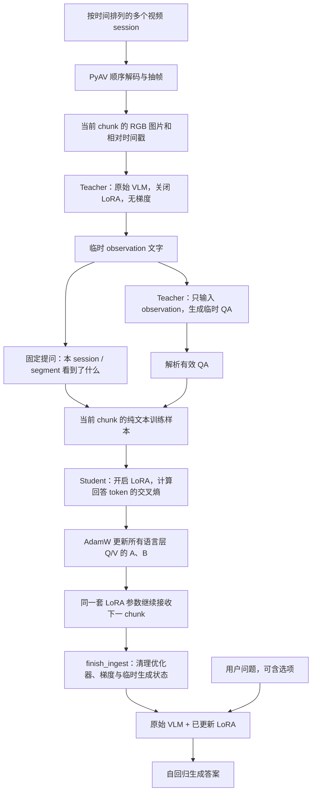
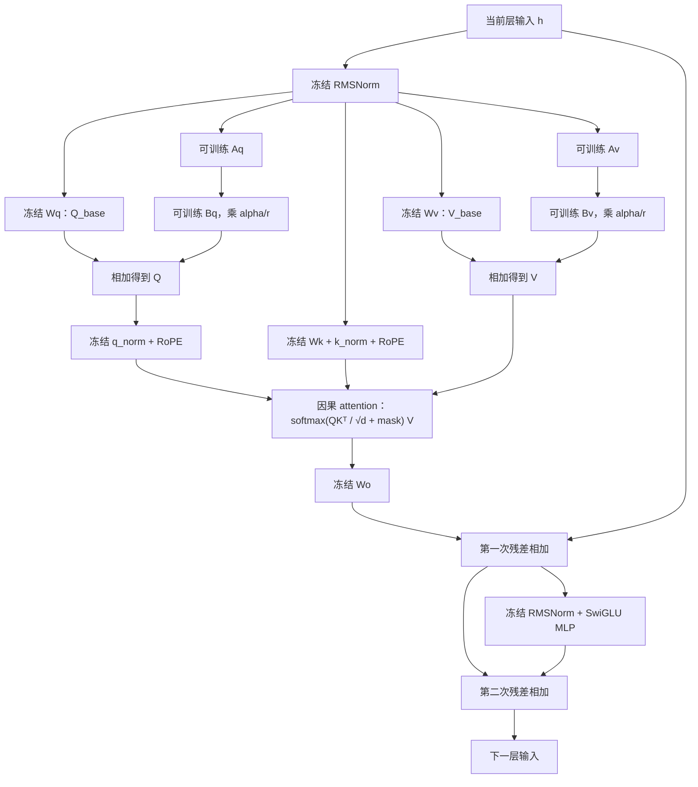

# 当前项目框架与 LoRA-TTT 参数结构

核对日期：2026-09-14。依据：本仓库代码 `eb47c57`、服务器 `meowbench` 环境中的实际实现，以及本地模型配置和已有记忆文件。本文解释当前实现，不把历史实验设想当成已实现功能。

后续新增了直接视觉写入的 Spatial-TTT 模块，见 [SPATIAL_TTT.md](SPATIAL_TTT.md)。本文保留对原 LoRA/LaCT 两条路线的说明；其中“两条路线”指新增模块之前的代码快照。

目前生成式视觉记忆的主线是：**冻结 VLM 看视频 → 生成临时观察和问答 → 在语言模型各层的 Q/V 投影上训练 LoRA → 丢弃临时数据 → 用更新后的参数回答问题。** 对本地 Qwen3-VL-2B，默认 rank=16 时，记忆分布在 28 层的 56 个投影中，共 112 个可训练张量、3,211,264 个 FP32 参数，净占 12.25 MiB。

## 1. 仓库包含什么

| 位置 | 当前职责 |
|---|---|
| [`ttt_frame/videoqa.py`](../ttt_frame/videoqa.py) | 新的生成式记忆：加载 VLM、注入 LoRA、teacher 生成、TTT 更新、问答、保存/恢复、CLI |
| [`ttt_frame/video.py`](../ttt_frame/video.py) | PyAV 顺序解码视频，输出有时间顺序的 RGB 帧块 |
| [`ttt_frame/lact.py`](../ttt_frame/lact.py) | 原有的独立 LaCT 向量记忆，维护三块 SwiGLU fast weights |
| [`ttt_frame/_lact_upstream.py`](../ttt_frame/_lact_upstream.py) | 保留的上游参考实现，用于追溯和回归比较 |
| [`scripts/exp_scene_change.py`](../scripts/exp_scene_change.py)、[`scripts/exp_centering_sensitivity.py`](../scripts/exp_centering_sensitivity.py) | 冻结 CLIP + LaCT 的关联记忆、干扰和中心化实验 |
| [`tests/test_videoqa.py`](../tests/test_videoqa.py)、[`tests/test_lact.py`](../tests/test_lact.py) | 参数更新、生命周期、解码、持久化以及 LaCT 数学行为测试 |
| `memories/<name>/` | 本地 LoRA 记忆文件，默认被 Git 忽略 |
| `/home/quzitsix/meowbench` | 旁边的评测仓库；负责问题格式、视频访问生命周期和评分 |

**LaCT 和 LoRA-TTT 是两条独立路线。** `videoqa.py` 没有调用 `LaCTMemory`，没有把 LaCT 输出接到 Qwen 上，也没有把 Qwen 的 attention 或 MLP 替换成 LaCT。MEOWBench 的 `meowbench/adapters/ttt_lact.py` 虽保留旧文件名，但通过 `--backend lora` 选择新的生成式实现；其默认 backend 仍是 `lact`。

## 2. 视频怎样变成参数记忆



这里的 teacher 和 student **共用同一个模型实例、同一份基座权重**。`teacher=True` 时进入 `disable_adapter()`；训练和正常读出时启用 adapter。没有另建 teacher 模型，没有 EMA teacher，也没有把上一块适配后的输出当成下一块 teacher 的知识。

各类模型调用的输入、参数开关和梯度不同：

| 调用 | 实际输入 | LoRA | 梯度 |
|---|---|---|---|
| 看视频生成 observation | 当前 chunk 的多张图片 + 描述提示 + 帧时间戳 | 关闭 | `inference_mode`，不建训练图 |
| 根据 observation 生成 QA | observation 文字 + QA 生成提示 | 关闭 | `inference_mode` |
| `_learn()` 写记忆 | 纯文字 question + assistant answer | 开启 | 仅 A/B 参与优化 |
| `answer()` 读记忆 | 当前用户问题，可能包含选项 | 开启 | `inference_mode` |
| `answer(use_memory=False)` 对照 | 同一个问题 | 关闭 | `inference_mode` |

所以视觉信息进入 LoRA 的连接是 **“生成文字 → 将文字作为监督目标”**。训练时不传图片，不对视觉 token 做重建，不将 teacher 的 hidden states 或 logits 直接蒸馏给 student，也没有穿过图片生成过程的反向传播。teacher 漏掉的细节不会自动出现在训练目标里。

源码入口：[`_generate`](../ttt_frame/videoqa.py#L285)、[`_learn`](../ttt_frame/videoqa.py#L306)、[`ingest_video`](../ttt_frame/videoqa.py#L346)。

## 3. 基座模型哪些部分冻结，哪些部分改变

模型由 `AutoModelForImageTextToText` 加载，要求是 decoder-only VLM。下表以本地 **Qwen3-VL-2B-Instruct** 为具体实例。其他架构的视觉连接和维度应按其实际代码检查。

| 参数块 | 在完整 VLM 中的作用 | 本项目中的更新情况 |
|---|---|---|
| `model.visual`：视觉编码器、主 merger、DeepStack mergers | 将图片变成语言模型可用的视觉特征 | 全部冻结 |
| `model.language_model.embed_tokens` | 文本 token → hidden states | 冻结 |
| 每层 `input_layernorm` / `post_attention_layernorm` | attention、MLP 前的 RMSNorm | 冻结 |
| 每层 attention 的原始 `q_proj` / `v_proj` 权重 | 原有 Q/V 线性投影 | 原权重冻结，旁边增加可训练 LoRA |
| 每层 attention 的 `k_proj` / `o_proj` | K 投影和 attention 输出投影 | 冻结，没有 LoRA |
| 每层 attention 的 `q_norm` / `k_norm` | 每个 head 上的 Q/K 归一化 | 冻结 |
| 每层 MLP 的 `gate_proj` / `up_proj` / `down_proj` | 原有 SwiGLU 前馈网络 | 冻结，没有 LoRA |
| 最后的 `norm` 和 `lm_head` | hidden states → 词表 logits | 冻结；2B 的输出头与输入 embedding 共享权重 |
| 新增 `q_proj.lora_A/B`、`v_proj.lora_A/B` | 对 Q/V 投影的低秩增量 | **唯一被 TTT 更新的模型参数** |

`language_lora_targets()` 遍历所有 `nn.Linear`，选取路径含 `language_model` 或 `text_model`、末尾为 `q_proj` 或 `v_proj` 的模块，并排除含 `vision`、`visual`、`connector`、`projector` 的路径。当前没有只选最后几层或给不同层设置不同 rank 的配置。

PEFT 注入后，代码检查所有 `requires_grad=True` 的参数名都含 `lora_`，然后将这些参数转成 FP32。基座默认 bf16，也可以显式选择 float32。`eval()` 不等于禁止求梯度；默认训练路径使用 eval 模式配合 `torch.enable_grad()`，仍能正常更新 LoRA。

### Qwen 原本的视觉连接被保留

本地 2B 基座的视觉塔有 24 层、视觉 hidden size=1024，merger 输出维度为 2048。主视觉输出填入语言输入序列的 image token 位置；视觉层索引 5、11、17 的 DeepStack 特征经过各自 merger，分别加到语言层 0、1、2 的输出中的视觉位置上。**这些都是已加载 Qwen 模型原有的连接。**

本项目 `_messages()` 将抽样帧作为多张 `image` 传给 processor，时间戳写进文字提示。它使用的是有序多图输入，并未调用原生连续视频输入接口，也没有新建时间编码器。正常记忆流程中，只有观察阶段有这些视觉输入；纯文本 TTT 和参数问答阶段不运行视觉塔。另有 `answer_with_images()` 接受显式图片，作为关闭 LoRA 的冻结视觉诊断对照。

依据：[`初始化与注入`](../ttt_frame/videoqa.py#L154)、[`目标选择`](../ttt_frame/videoqa.py#L107)、[`消息编码`](../ttt_frame/videoqa.py#L257)，以及当前环境 `transformers/models/qwen3_vl/modeling_qwen3_vl.py` 的 `Qwen3VLVisionModel`、`Qwen3VLTextModel`、`Qwen3VLModel`。

## 4. 单层内部：A/B 怎样接到 attention

采用列向量记法，对任意一个被选中的线性投影：

```text
W_base ∈ R[d_out, d_in]       原始权重，冻结
A      ∈ R[r, d_in]           可训练，先降维
B      ∈ R[d_out, r]          可训练，再升维
s = lora_alpha / r            固定缩放系数

y = W_base x + s · B(Ax)      若基座有 bias，原 bias 也保留且冻结
ΔW = s · BA
```

这是输入分成两路、结果相加的连接。A 后接 B，中间没有新增激活函数。默认 `r=16`、`alpha=32`，所以 `s=2`；`lora_dropout=0`、`bias="none"`，不启用 DoRA 或 RS-LoRA。标准初始化为 A 随机 Kaiming、B 全零，因此初始增量为零；reset 后也恢复这个初始函数。

Qwen 语言层的主要前向路径如下；`Q_base/V_base` 表示冻结投影的输出：



这里省略了 batch、head reshape 和 GQA 的 KV head 分组细节；Qwen 实际上先进行 Q/K head 归一化与 RoPE，再计算 attention。

可以从三个层次理解参数之间的关系：

1. **投影内部：** `Aq → Bq` 和 `Av → Bv` 各自串联，再分别与原 Q/V 支路相加。一个投影的 LoRA 作用在完整投影矩阵上，并非每个 attention head 各建一套 A/B。
2. **同层内部：** Q 的变化影响 token 之间的注意力权重；V 的变化影响被注意力聚合的内容。K/O、MLP 的权重固定，但仍参与前向和梯度传递。
3. **层与层之间：** 第 0 层的输出经残差流进入第 1 层，依次直到第 27 层。每层 A/B 独立，没有参数共享或直接拼接；它们通过 hidden states 和同一个最终语言损失共同工作。

**冻结权重不表示激活恒定。** 前面层的 LoRA 改变了后面层的输入，所以即使某层的 `Wk`、`Wo` 或 MLP 没变，其计算出的 K、输出特征仍可能改变。反向传播会穿过这些冻结运算，更新上游 LoRA，而不会优化其原始权重。

PEFT 在前向时计算低秩支路并与基座输出相加；当前代码没有调用 `merge_and_unload()` 将增量永久并入原权重。默认基座 bf16、A/B FP32，PEFT 会进行分支计算所需的 dtype 转换，返回原输出 dtype。

## 5. 参数具体分布与容量

### 5.1 Qwen3-VL-2B：当前默认和已有记忆的共同结构

本地配置：语言层数 `L=28`，hidden size `h=2048`，Q heads=16，KV heads=8，head dim=128。因此 Q 输出维度为 2048，V 输出维度为 1024。**由于使用 GQA，V 的矩阵比 Q 小。**

每一层都分配以下四个独立张量，表中的 shape 与 PyTorch 存储顺序一致：

| 参数块 | 原始投影 shape `[out,in]` | LoRA shape | 单层可训练参数数 | 28 层合计 |
|---|---|---|---:|---:|
| `q_proj.lora_A` | `[2048,2048]` | `[16,2048]` | 32,768 | 917,504 |
| `q_proj.lora_B` | 同上 | `[2048,16]` | 32,768 | 917,504 |
| `v_proj.lora_A` | `[1024,2048]` | `[16,2048]` | 32,768 | 917,504 |
| `v_proj.lora_B` | 同上 | `[1024,16]` | 16,384 | 458,752 |
| **合计** | 每层 2 个插入点 | 每层 4 个张量 | **114,688** | **3,211,264** |

Q 分支合计 1,835,008 个参数，V 分支合计 1,376,256 个参数。每一层的容量相同，没有单独的“人物块”“物品块”或“位置块”；事实经过训练分散编码在这些低秩增量中，代码没有规定某个矩阵专门存哪类事实。

实际名称举例：

```text
# 注入前的完整目标路径，i = 0, ..., 27
model.language_model.layers.i.self_attn.q_proj
model.language_model.layers.i.self_attn.v_proj

# PEFT 包装后，named_parameters() 中的第 0 层 Q 分支
base_model.model.model.language_model.layers.0.self_attn.q_proj.base_layer.weight
base_model.model.model.language_model.layers.0.self_attn.q_proj.lora_A.default.weight
base_model.model.model.language_model.layers.0.self_attn.q_proj.lora_B.default.weight
```

`default` 是 adapter 名称，全模型使用同一个 adapter 名，但不同层、不同投影的张量彼此独立。保存为 PEFT state dict 时，键名中的 `.default` 会被移除。

### 5.2 基座和新增参数的比例

以下数量通过本地配置构造 meta 模型并调用 `tie_weights()` 去重统计，不分配整模型权重显存：

| Qwen3-VL-2B 参数组 | 参数数 | TTT 是否更新 |
|---|---:|---|
| 视觉塔和全部 mergers | 406,957,056 | 否 |
| 文本 embedding / 共享输出头，计一次 | 311,164,928 | 否 |
| 28 个语言 decoder 层的原始参数 | 1,409,408,000 | 否 |
| 最终文本 RMSNorm | 2,048 | 否 |
| **原始基座合计** | **2,127,532,032** | 否 |
| **新增 LoRA 合计** | **3,211,264** | **是** |

新增可训练参数约占“基座 + LoRA”总参数的 **0.151%**。基座是共享的预训练能力；这次输入视频带来的新增内容由 LoRA 携带。

### 5.3 通用公式和本机其他配置

令 `d_q = num_attention_heads × head_dim`，`d_v = num_key_value_heads × head_dim`。相同宽度的语言层中：

```text
每个投影的 LoRA 参数数 = r × (d_in + d_out)
每层 Q/V LoRA 参数数   = r × (2h + d_q + d_v)
全模型 LoRA 参数数     = L × r × (2h + d_q + d_v)
插入点数              = 2L
A/B 张量数            = 4L
FP32 净记忆字节数      = 参数数 × 4
```

不能对所有模型一概假设 `d_q=h`；这里两个本地 Qwen 配置恰好满足。

| 配置 | 层数 | rank / alpha | LoRA 参数数 | FP32 净容量 |
|---|---:|---|---:|---:|
| Qwen3-VL-2B，历史小规模链路检查 | 28 | 4 / 8 | 802,816 | 3,211,264 bytes = 3.0625 MiB |
| **Qwen3-VL-2B，当前默认/已有记忆** | **28** | **16 / 32** | **3,211,264** | **12,845,056 bytes = 12.25 MiB** |
| Qwen3-VL-8B，本机配置结构核对 | 36 | 16 / 32 | 7,667,712 | 30,670,848 bytes = 29.25 MiB |

8B 的 `h=4096`、`d_q=4096`、`d_v=1024`，共有 72 个插入点、144 个张量。此处只核对其结构，没有在本次文档工作中运行 8B 视频训练或评测。

### 5.4 磁盘上的已有记忆

`memories/video_test_01/` 的 `memory.json` 和 safetensors 张量头已直接读取核对：

- 基座为 `/data/quzitsix/models/Qwen3-VL-2B-Instruct`；rank=16、alpha=32；112 个张量全部为 FP32，与上表一致。
- 采样设置为 **8 秒/块、每块最多 4 帧**，teacher 输出上限 **512 tokens**；这两项与代码默认的 30 秒、256 tokens 不同。
- 元数据记录 1 个 session、3 个 chunk、9 帧、12 条伪 QA、36 个优化步骤。
- 权重文件实际大小为 12,861,632 bytes，比净张量字节数多出 safetensors 文件头；文件大小和 `memory_bytes` 不是同一口径。

这些是已有产物的记录，本次没有重新执行该视频训练，也不据此推断记忆准确率。

## 6. TTT 究竟优化什么

对一个 chunk，teacher 最多生成 `qa_per_chunk=4` 条有效 QA。代码**始终额外加入一条**：

```text
Question: What was observed in session {session}, segment {segment}?
Answer:   当前 chunk 的完整 observation
```

因此默认每块有 1–5 个训练样本。QA 解析失败、数量为零或配置为零时，仍使用 observation 样本训练，并增加 `caption_only_chunks` 计数。QA teacher 只收到当前 observation，不收到之前 session 的笔记或 benchmark 标准问答。

每个样本用 chat template 编码，验证 question prompt 是完整训练序列的精确前缀，然后将 prompt 和 padding 的标签设为 `-100`。因果语言模型内部执行 next-token shift，损失只覆盖保留下来的 assistant completion tokens（包括模板可能带入的结束标记）。

设当前块有 `m` 个样本，每个样本的有效 assistant token 集为 `A_j`，优化目标可写为：

```text
L_chunk(θ) = (1/m) Σ_j [ -(1/|A_j|) Σ_{t∈A_j} log p_(W_base,θ)(y_t | prompt_j, y_<t) ]
θ = 所有语言层的 {Aq, Bq, Av, Bv}
```

这是先按样本内部 token 求平均，再按样本求平均。长 caption 并不会仅因为 token 更多就获得更大的样本权重。训练用真实目标前缀进行 teacher forcing。

[`_learn()`](../ttt_frame/videoqa.py#L306) 的一次 chunk 更新过程是：

```text
将当前块的 QA + observation 编码为临时样本
首次写入时创建 AdamW，只传入 LoRA 参数
重复 steps_per_chunk 次：
    清空梯度
    遍历当前块的每个样本：forward；(loss / 样本数).backward()
    对全部 LoRA 梯度联合裁剪到 norm <= 1.0
    optimizer.step()
清空梯度，丢弃当前块样本
```

默认每块 **12 次 optimizer step**，不是每个 QA 12 次。默认学习率 `2e-4`，weight decay=0；没有学习率调度器、分层学习率或独立的各块 optimizer。可选 gradient checkpointing 使用 `use_reentrant=False`，训练前向 `use_cache=False`。

**同一环境的所有 chunk 和 session 连续更新同一套 LoRA，AdamW 动量也在摄入期间连续保留。** 当前没有 replay buffer、逐事件 adapter、检索路由、容量随视频增长、抗遗忘正则或可学习写入 gate。后面的 chunk 可能改变先前事实的读出。代码也没有训练一个跨任务的外循环或学习 TTT 初始化；这里的 TTT 指在当前测试环境的视频上临时优化参数。

## 7. 参数状态、保存边界与读出

```text
构造 / reset()
    ↓  LoRA 恢复为初始 A/B，计数清零
ingesting
    ↓  ingest_video(day1) → ingest_video(day2) → ...
finish_ingest()
    ↓  丢弃 optimizer、清梯度、清 rope_deltas、切 eval
ready
    ├─ answer(question)                 参数问答，不更新
    ├─ answer(question, use_memory=False) 原始模型对照
    └─ save(new_directory)              保存参数记忆

摄入异常 → failed → 需要 reset()
新实例 load_memory(directory) → 校验并加载 → ready
```

`finish_ingest()` 的“封存”通过状态检查、清理训练状态和 inference-mode 查询实现；它没有把 A/B 的 `requires_grad` 改为 False。`ready` 后不能再直接 `ingest_video()`。现有加载接口也直接进入 `ready`，**没有从已保存记忆继续增量摄入的公开接口**；调用 `reset()` 会恢复最初 adapter，而不是保留已学记忆。

| 状态块 | 摄入期间 | 正常问答期间 | 保存到记忆目录 |
|---|---|---|---|
| 原始基座权重 | 常驻，冻结 | 常驻，冻结 | 否，独立加载 |
| 当前 LoRA A/B | 常驻，被更新 | 常驻，用于前向 | 是：`adapter.safetensors` |
| `_initial` 初始 A/B 副本 | CPU 常驻，用于 reset | 对象中仍保留 | 否 |
| AdamW 一阶/二阶状态 | 跨 chunk/session 保留 | `finish_ingest` 后释放引用 | 否 |
| 梯度与训练激活 | 当前训练过程使用 | 清空/释放引用 | 否 |
| 帧、observation、QA 和训练样本 | 当前块的临时数据 | 不作为对象记忆保留 | 否 |
| KV cache | 当前生成调用临时使用 | 每次问题自己生成，不继承摄入历史 | 否 |
| `rope_deltas` | Qwen 单次调用可能设置 | 生成前后与边界处显式清空 | 否 |
| 配置、目标路径、架构指纹、统计 | 保留 | 保留 | 是：`memory.json` |

`memory_bytes` 只计当前 LoRA 的 tensor 字节。2B rank=16 的 `_initial` 还占 12.25 MiB CPU 内存；训练期间还需 AdamW 状态、梯度、基座、激活和生成 KV。`ingest_peak_cuda_allocated_bytes` 统计的是含基座及临时张量的 CUDA allocated 峰值，不应当成净记忆大小。

保存目录只生成上述两个文件，是项目自定义格式，使用 `load_memory()` 恢复。加载会检查格式版本、基座配置哈希、目标模块、rank/alpha、tensor 键名/shape 和有限值。**配置哈希不是全部基座权重文件的哈希**，因此需要使用完全相同的基座 checkpoint；仅模型架构相同还不够。

可选 `trace_file` 会把 observation 和 QA 写到另一个评估日志中。模型不读回该日志；但打开 trace 时，磁盘上会额外存在视频衍生文字，不能说整个实验从未保存过文字。

入口：[`reset`](../ttt_frame/videoqa.py#L233)、[`finish_ingest`](../ttt_frame/videoqa.py#L405)、[`answer`](../ttt_frame/videoqa.py#L424)、[`save/load_memory`](../ttt_frame/videoqa.py#L433)。

## 8. 相对原始 VLM，项目实际增加了什么

| 改动 | 带来的行为 | 没有改变的基座结构 |
|---|---|---|
| 给全部语言层 Q/V 注入 PEFT LoRA | 通过小规模参数增量适配当前视频内容 | 原 attention 计算、GQA、RoPE、MLP、残差连接 |
| 冻结基座，只将 A/B 设为训练目标并使用 FP32 | 优化范围限定为参数记忆 | 视觉塔、merger、embedding、原始线性权重和输出头 |
| 用 adapter 开关复用 teacher/student | teacher 始终来自原始基座，student 累积 LoRA 更新 | 没有增加第二份 teacher 权重 |
| 增加观察提示、伪 QA、回答 token 掩码和 AdamW 内循环 | 从视频自生成临时文本监督并写入参数 | 没有新增视觉训练损失或任务专用分类头 |
| 增加 reset/封存/保存/恢复及状态检查 | 按环境隔离记忆，在无原视频的新进程问答 | 没有修改模型词表、加入持久记忆 token 或外部检索库 |
| 清理 Qwen `rope_deltas`，区分训练/生成 cache 设置 | 避免前次视觉调用状态进入下一次问答 | 没有重写 Qwen 的位置编码公式 |

当前没有人物身份识别、跨摄像头追踪、显式人物—物体关系图、所有权推断器或跨场景关系保持模块。提示词会要求区分持有与拥有、避免编造身份，但提示词约束本身不是专用感知或关系推理模块。

## 9. 旧 LaCT 参数块如何连接

这一节用于读懂仓库保留的机制实验。**以下 `fw0/fw1/fw2` 与上文 Qwen LoRA 的 A/B 没有连接。**

```text
写入：tokens ─wk→ 分 head 的 k ───────────────┐
      values ─wv→ 分 head 的 v ───────────────┼→ lact_update → fw0/fw1/fw2
      tokens ─w_lr→ softplus → 三组学习率 ────┘

读取：query ─wq→ 分 head 的 q → f_fw(q) → 拼回各 head ─wo→ 记忆向量

每个 head 的 f_fw(x) = fw1 [ silu(fw0 x) ⊙ (fw2 x) ]
```

若总维度为 `D`、head dim 为 `d`、head 数 `H=D/d`、中间维度 `m=int(d×inter_multi)`：

| 参数/状态块 | shape | 当前默认行为 |
|---|---|---|
| `wq/wk/wv/wo` | 各 `[D,D]` | `projection="identity"`、`learn_projections=False`，为冻结恒等投影 |
| `w_lr` | `[3H,D]` | 冻结随机投影，每个 token/head 产生三组更新率 |
| `fw0` | `[H,m,d]` | 写入时手工更新的 fast-weight buffer |
| `fw1` | `[H,d,m]` | 同上 |
| `fw2` | `[H,m,d]` | 同上 |

fast weights 参数槽总数为 `3Hmd`；例如 `D=512,d=64,inter_multi=1` 时为 98,304 个值，FP32 占 0.375 MiB。它们注册为 `persistent=False` buffer，默认不在普通 `state_dict()` 中持久化；这是与 Video LoRA 自定义保存接口不同的状态设计。

默认 `qk_l2_norm=True`，所以图中分 head 后的 k 和 q 还会先做 L2 归一化，v 不做这一步。`write()` 在 `no_grad` 下按解析公式更新三块权重，可对更新量做 Muon/Newton–Schulz 正交化，再保持各权重行的更新前范数。这里没有对整个 VLM 做反向传播，也不用 LoRA 的 AdamW。`values` 可独立输入以写入“物体 → 人物”绑定；省略时退回自关联。

与保留的上游 minimal layer 相比，当前 `lact.py` 的主要修改是：修正 Muon 把梯度误赋给权重的错误；将每次 forward 使用的初始权重改成跨 `write()` 保留的状态；增加独立 write/read/reset 和显式 values；默认使用恒等投影；取消上游 QKV 投影后的 SiLU 与读出 head RMSNorm，以保持探针的向量读出空间；将 `torch.compile` 改为通过 `MEOW_TTT_COMPILE=1` 显式开启。`learn_projections=True` 虽可设置参数的梯度标记，但公开的 `write/read` 都带 `no_grad`，仓库没有配套的投影外循环训练。

具体实现见 [`LaCTMemory`](../ttt_frame/lact.py#L178)、[`lact_update`](../ttt_frame/lact.py#L98) 和 [`上游参考`](../ttt_frame/_lact_upstream.py)。

## 10. 这台服务器上的配置与验证

本机是 Linux，项目目录 `/home/quzitsix/TTT_frame`。**Python/pip 使用现有 conda `meowbench` 环境**；旧文档中 Windows 的 `claude` 路径属于另一台机器。

本次实际检查：

| 项目 | 结果 |
|---|---|
| Python | `/home/quzitsix/miniconda3/envs/meowbench/bin/python`，Python 3.11 |
| 依赖 | torch 2.9.1、transformers 4.57.6、PEFT 0.20.0、Accelerate 1.14.0、PyAV 18.1.0、safetensors 0.8.0 |
| GPU | CUDA 可用，8 张 NVIDIA GeForce RTX 4090 D；当前引擎一次将模型放在指定的一张卡上 |
| 本地权重目录 | `/data/quzitsix/models/Qwen3-VL-2B-Instruct`、`/data/quzitsix/models/Qwen3-VL-8B-Instruct` |
| 现有测试 | `conda run -n meowbench python -m pytest -q`：**25 passed in 7.11s** |
| 参数核对 | 从本地 config 构建 meta 模型并注入 PEFT，验证 2B/8B 目标路径、层数和 A/B shapes；读取已有 2B safetensors 验证真实 tensor 数量、dtype 和体积 |

无需为本次文档工作安装或升级环境。代码默认配置与含义如下：

| 配置项 | 代码默认值 | 控制内容 |
|---|---|---|
| `rank` / `lora_alpha` | 16 / 32 | 每个 Q/V 投影的低秩容量 / 增量缩放 |
| `learning_rate` / `steps_per_chunk` | `2e-4` / 12 | 当前块的更新强度 |
| `chunk_seconds` / `frames_per_chunk` | 30 / 4 | 抽样块时长 / 每块最多帧数 |
| `max_side` | 448 | PIL 缩略图的最大边长；VLM processor 仍会执行自己的图像预处理 |
| `max_chunks` | 0 | 0 表示处理完整视频；正数限制每个输入视频的抽样块数 |
| `qa_per_chunk` | 4 | 每块最多有效伪 QA 数，此外总有一条 observation 样本 |
| `teacher_max_new_tokens` | 256 | observation 和伪 QA 两次生成各自的输出上限 |
| `max_length` | 1024 | 每个文本训练样本的最大长度，超出会截断并计数 |
| `max_new_tokens` | 128 | 正常回答输出上限 |
| `dtype` / `attn_implementation` | bfloat16 / sdpa | 基座 dtype / attention 后端 |
| `gradient_checkpointing` / `seed` | False / 0 | 是否重计算训练激活 / adapter 初始化随机种子 |

抽帧发生在等分子区间的起点：默认目标是 0、7.5、15、22.5 秒，再到下一块。实际选取到达目标时间的解码帧，末尾短块可能不足 4 帧。时间戳从每个视频的首个解码帧开始计算；跨视频顺序由调用方给出的列表确定，代码不根据文件名自动排序。

在本机使用已有参数记忆回答的命令：

```bash
cd /home/quzitsix/TTT_frame
conda run --no-capture-output -n meowbench python -m ttt_frame.videoqa ask \
  --memory memories/video_test_01 \
  --model-path /data/quzitsix/models/Qwen3-VL-2B-Instruct \
  --local-files-only \
  --question "What was observed in session 1, segment 1?"
```

摄入新视频的模板（替换视频路径，保存目录需尚不存在）：

```bash
conda run --no-capture-output -n meowbench python -m ttt_frame.videoqa ingest \
  --model-path /data/quzitsix/models/Qwen3-VL-2B-Instruct \
  --local-files-only \
  --video /path/to/day1.mp4 /path/to/day2.mp4 \
  --chunk-seconds 8 --frames-per-chunk 4 \
  --rank 16 --lora-alpha 32 --steps-per-chunk 12 \
  --teacher-max-new-tokens 512 \
  --save memories/new_environment
```

上面 8 秒、512 tokens 是显式覆盖，采用已有记忆的预算。命令是使用说明，本次文档工作没有重新跑真实视频摄入或生成评测。测试通过说明实现行为和接口回归检查通过；当前视觉记忆质量、长期抗干扰和跨场景人物—物体绑定能力仍应通过独立评测判断。已有结果和局限见 [2026-09-11 真实视频报告](REPORT_20260911_REAL_VIDEO.md)。
