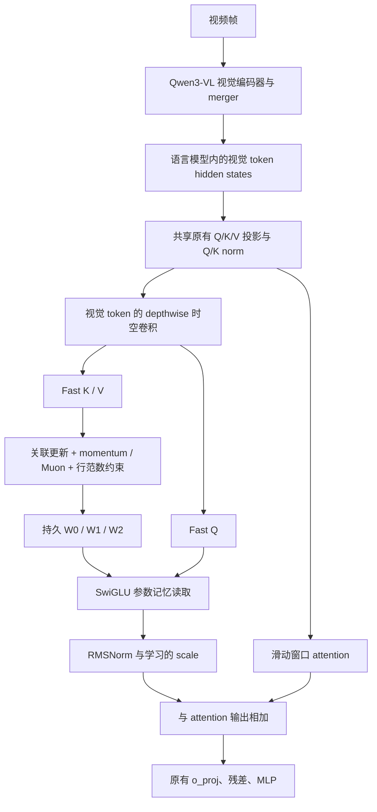

# Spatial-TTT 视觉参数记忆

核对日期：2026-09-14。参考官方仓库提交
`e2e33a62b6f92c33b7e24ff042be9737d05c5bdb`。

这条路线把**视频产生的内部视觉表示直接写入模型内的 fast weights**：输入改变三块记忆矩阵，之后的问题通过这些矩阵读出历史信息。摄入不再调用 caption/QA teacher，也不再用伪文字监督更新 Q/V LoRA。原有 LoRA 路线保留用于对照，其结构见 [ARCHITECTURE_LORA_TTT.md](ARCHITECTURE_LORA_TTT.md)。

实现目标是复现 Spatial-TTT 的核心记忆机制，并适配本项目“视频撤销后只通过参数回答”的条件。**机制可运行不等于家庭长期记忆能力已经训练完成，也不等于复现了论文分数。** 新增的 slow weights 需要离线训练，或从兼容的已训练 checkpoint 加载。

## 1. 模型中的连接



每四层保留一层完整 attention，其余三层为 SWA 与 TTT 并行层。Qwen3-VL-2B 的官方 nano 对应 21 个 TTT 层：

```text
0,1,2, 4,5,6, 8,9,10, 12,13,14, 16,17,18, 20,21,22, 24,25,26
```

第 `3,7,11,15,19,23,27` 层为完整 attention。这里的“完整”指该次前向可见的上下文；本项目不会让它的历史视频 KV 跨独立摄入/查询调用永久保留。

TTT 与 attention 共享基座 Q/K/V 投影，因此写入信号直接来自模型正在处理的视觉信息。GQA 的 K/V 会按 attention heads 扩展，再重排为 fast-weight heads。深度时空卷积只处理正确网格中的视觉 token；文字 token 不应被当成图像网格卷积。Qwen3-VL 的视觉编码器、merger、DeepStack 和语言模型 MLP 仍属于基座。

## 2. 参数分别做什么

slow weights 是模型离线学会的“怎样写入和读出”；fast weights 是一次持续观察过程中的“已经记住了什么”。两者应分别保存和恢复。

| 参数块 | 作用 | 摄入时是否改变 |
|---|---|---|
| 视觉编码器、merger、语言模型 Q/K/V/O、MLP 等基座参数 | 产生与解释视觉语义 | 否 |
| 初始 `w0/w1/w2` | 为新记忆提供训练好的起点 | 否；reset 从这里复制 |
| `q_scale/q_offset/k_scale/k_offset` | 为 TTT 分支调整共享 Q/K | 否 |
| `conv_q/conv_k/conv_v` | 对视觉网格施加每通道 3×3×3 时空卷积 | 否 |
| `lr_proj` | 从当前 hidden states 生成三个矩阵各自的写入率 | 否；它的输出随输入变化 |
| `momentum_proj` | 生成写入动量系数 | 否 |
| `ttt_norm`、`ttt_scale_proj` | 将记忆读出归一化并混合进语言模型 | 否 |
| 当前 `W0/W1/W2` | 已写入的参数记忆 | **是** |
| 动量状态及行范数参考 | 支持后续稳定更新 | 动量改变，范数参考保持 |

以 nano/2B 的 `hidden_size=2048`、4 个 fast heads、`inter_multi=1` 为例，每头宽度为 512；三个矩阵形状均为 `[4,512,512]`。每个 TTT 层的当前记忆有 3,145,728 个数；21 层共有 **66,060,288 个数，FP32 约 252 MiB**。如果同时保留三块同形动量，另需约 252 MiB。此处不包括基座、slow weights、临时激活和 attention KV。这比 rank=16 的 Q/V LoRA 记忆容量大，代价也更高。

## 3. 输入如何改写三块矩阵

对一个 fast head，记忆函数为：

```text
f_W(x) = W1 · (SiLU(W0 · x) ⊙ (W2 · x))
```

以 K 作为写入地址、V 作为写入内容，按官方解析梯度计算三块更新。对应的关联目标可以写成 `-Σ Vᵀf_W(K)`，更新方向是增加 K 与 V 的关联；**不是把 teacher 的答案交叉熵搬到这个 MLP 上，也不是未经核对就替换成平方误差。** 各 token 的写入率由 `softplus(lr_proj(hidden) + inv_softplus(0.001))` 产生。

一个 chunk 内先用旧 W 读 Q，再用当前 K/V 更新 W，避免当前 chunk 通过更新后的参数读取其后面的 token。可选动量累计更新方向，Muon/Newton–Schulz 变换调整方向，最后恢复初始行范数以限制状态尺度。跨 chunk 持续传递更新后的 W。

同一套参数反复写入提供了跨片段的记忆载体；固定容量和范数约束本身不能证明不会遗忘。人物身份、物体归属、时间顺序、旧位置与最新位置的区分，仍需要相应的离线训练与持续观察评测。

启用 Muon 时，更新的整体幅度会被正交化步骤大幅消去，`base_lr` 不能简单解释为普通 SGD 中线性控制步长的旋钮。需要考察实际 W 的变化和记忆读出，而不能仅通过减小这个数预期等比例减小所有参数更新。

## 4. 相对于官方实现的任务适配

官方推理还使用 SWA KV、完整 attention KV、等待下一次更新的 K/V，以及卷积所需的邻帧信息。仅把官方 `LaCTCache` 保存为文件，不能称为本项目所要求的参数记忆。

本项目的生命周期以参数为长期状态：视频块处理完成后撤销临时视觉输入与该次 attention 缓存；后续块从此前的 W 继续；问答期间只读 W；保存的长期记忆不包含视频帧、caption、embedding 检索库或历史视频 KV。对视频块末尾也必须完成写入，否则短于 TTT chunk 的最后一段可能未进入长期参数。

这些改变会影响与官方完整上下文推理的数值等价性，也提高了训练时模拟“无视频 KV 查询”的必要性。有限视频块内的时空卷积也不能被描述为跨任意摄入边界的完整时空卷积。

当前是纯 PyTorch/SDPA 参考实现：常规 fast-weight 读写矩阵乘使用 FP32，Muon 保留官方的 BF16 Newton–Schulz 计算；不要求与官方融合 GPU kernel 逐 bit 一致。每次视频摄入都提交尾块；`position_offset` 随摄入推进并保存，问答使用接续的位置但不改变该计数。

## 5. 为什么还需要训练好的 slow weights

官方 `ttt_scale_proj.weight` 和 `bias` 都以 0 初始化，经过 SiLU 后仍为 0。直接把新模块接到普通 Qwen3-VL 上时，W 可以随视频更新，但记忆分支暂时不会影响模型输出。随意把 scale 改成非零只能让分支产生影响，不能让随机初始化的读写参数自动获得可靠记忆语义。

可用的两条起点是：加载同结构、已训练的 Spatial-TTT slow checkpoint；或离线训练新增模块及适当的语言模型参数，让答案损失教会网络如何存储、保留和读取视觉证据。官方公开训练脚本冻结视觉与 merger，训练语言模型并包含 TTT 模块；所以只从其 checkpoint 提取新增 TTT 权重再叠在原始 Qwen 上，并不等于加载官方训练模型。

针对本项目，离线训练还应包含跨多个视频块的写入、清除视频 KV 后的文字问答、问答后的继续观察，以及状态变化与较久历史的共同监督。需要独立报告“输入是否改变参数”和“这些参数是否支持正确回答”，后者不能由前者推导。

## 6. 官方 checkpoint 的加载注意事项

截至核对日期，公开的 [THU-SI/Spatial-TTT-nano](https://huggingface.co/THU-SI/Spatial-TTT-nano/tree/main) 是基于 Qwen3-VL-2B 的训练模型。已读取 config、文件列表、索引及 safetensors 文件头确认结构，未下载其大权重，也未在本次工作中验证其家庭问答准确率。

文件列表实际有一个约 5.02 GB 的 `model.safetensors`，但 `model.safetensors.index.json` 的 `weight_map` 指向列表中不存在的两个分片。应优先使用真实存在的单文件。其普通 `config.json` 未完整记录 TTT 的层选择、chunk 和窗口等选项，不能只靠 `AutoModel.from_pretrained()` 推断新增结构。

该文件列表也未包含 `tokenizer.json` 或 `merges.txt`。处理器可从兼容的原始 Qwen3-VL-2B 目录加载，模型则先建立 TTT 结构，再载入完整训练权重。

官方 key 以 `model.language_model.layers.N.self_attn.` 开头。TTT 层的原 attention 多一级 `attn_layer`，例如 `attn_layer.q_proj.weight`；新增的 `w0/w1/w2`、`lr_proj`、`momentum_proj.0`、卷积、norm、scale 则直接挂在该层。完整 attention 层没有这一层 `attn_layer`。如果本地将记忆核心注册为子模块，需要对新增键做对应的重命名，严格检查 missing/unexpected keys 和 shapes，不能静默跳过新权重。

nano 的 W0/W1/W2 为 **dense `[4,512,512]`**，不是上游 wrapper 默认 `w0_w2_low_rank=32` 的左右因子。`lr_proj.weight` 为 `[12,2048]`，动量和 scale 投影为 `[4,2048]`，`ttt_norm.weight` 为 `[512]`，三个卷积各为 `[2048,1,3,3,3]`。

已在 `meowbench` 环境中用本地 2B config 构造不分配实际权重的 meta 模型并安装本地 wrapper：完整 `state_dict` 经 `self_attn.memory.` → `self_attn.` 映射后，与官方单文件 header 的 **983 个 tensor key 和 shape 全部匹配**，没有缺失或额外键。这是结构兼容检查，不包含下载完整权重后的推理验证。

本机当前已确认的基座位于 `/data/quzitsix/models/Qwen3-VL-2B-Instruct` 和 `/data/quzitsix/models/Qwen3-VL-8B-Instruct`；在已检查的本用户模型目录与 HF 缓存中未发现官方 Spatial-TTT checkpoint。

## 7. 本机运行与保存

本机是 Linux，项目位于 `/home/quzitsix/TTT_frame`，Python 使用现有 conda **`meowbench`** 环境。新路线的入口为 `ttt_frame.spatial_videoqa`，配置类为 `SpatialVideoConfig`，生命周期类为 `SpatialVideoMemory`；内部 `spatial` 字段是 `SpatialModelConfig`。

```bash
cd /home/quzitsix/TTT_frame
conda run --no-capture-output -n meowbench python -m ttt_frame.spatial_videoqa --help
```

使用已下载的兼容官方完整权重摄入视频：

```bash
conda run --no-capture-output -n meowbench python -m ttt_frame.spatial_videoqa ingest \
  --model-path /data/quzitsix/models/Qwen3-VL-2B-Instruct \
  --spatial-checkpoint /path/to/Spatial-TTT-nano/model.safetensors \
  --video /path/to/first_clip.mp4 \
  --save /path/to/memory_after_first_clip

conda run --no-capture-output -n meowbench python -m ttt_frame.spatial_videoqa ask \
  --memory /path/to/memory_after_first_clip \
  --question '我最后看到杯子放在哪里？'

conda run --no-capture-output -n meowbench python -m ttt_frame.spatial_videoqa resume \
  --memory /path/to/memory_after_first_clip \
  --video /path/to/second_clip.mp4 \
  --save /path/to/memory_after_second_clip
```

这些 `/path/to/` 是需要替换的输入和输出路径，不代表本机已经下载了官方权重。`resume` 在已有参数上继续写入，可用于“观察—问答—继续观察”的同一条记忆轨迹；`reset` 才恢复初始记忆。

若省略 `--spatial-checkpoint`，新增 slow 参数使用初始化值，默认 `ttt_scale_init=0`。这适合检查参数是否随输入变化；无法据此测试已训练的视觉记忆能力。显式设置 `--ttt-scale-init 0.1` 可检查非零分支是否影响 logits，只用于机制诊断。

保存目录包含：

| 文件 | 内容 |
|---|---|
| `fast_weights.safetensors` | 运行态三块 W、行范数参考、动量和计数；没有未写入 token 缓冲 |
| `spatial.safetensors` | 新增 slow 参数，包括初始化 W、卷积、写入率、norm 和 scale |
| `memory.json` | 配置、模型/记忆元数据与恢复所需信息 |

第二个文件是训练好的读写规则，不是额外的视频 token 存储。保存目录不复制完整 VLM；恢复仍依赖原始基座文件，以及配置指定的同一份官方完整 checkpoint（如使用）。仅保证同名或同结构不足以确保兼容，训练过的语言模型权重也必须一致。

加载会验证 fast/slow tensor 的键、形状、数值与配置，并在验证失败时保留已有记忆。`base_fingerprint` 是基座**配置**的摘要，不是原始 Qwen 权重文件的哈希；未使用官方 checkpoint 时，调用方仍需保证使用同一份原始基座。指定官方完整 checkpoint 时，还会计算并核对该权重文件的 SHA-256。每次摄入结束会检查写入后的 W、动量和范数参考，不能仅用 logits 有限来判断最后一次写入有效。

核心文件为 [`spatial_memory.py`](../ttt_frame/spatial_memory.py) 的矩阵更新与运行态、[`spatial_model.py`](../ttt_frame/spatial_model.py) 的 Qwen3-VL 连接/上下文控制，以及 [`spatial_videoqa.py`](../ttt_frame/spatial_videoqa.py) 的视频摄入与恢复问答。`SpatialQwenMemory` 提供 `context(mode="write"/"read"/"base")`、`reset()`、`detach()`、`flush()` 及 slow/fast state 的导出导入；`base` 模式调用原 attention，可用于机制对照。

当前没有面向视频路径的离线 `train`/`calibrate` CLI；实际在线视频摄入仍在
`no_grad` 下完成。新增的 [`ttt_frame.spatial_trainer`](../ttt_frame/spatial_trainer.py)
提供一个低层、teacher-forced 的 `SpatialOfflineTrainer.train_episode` API：调用方先
准备按时间排序的 processor video batches 和带 `-100` prompt mask 的 QA batch，训练器
再执行可微 write、text-only read、一次 QA 交叉熵反向传播和 slow-parameter 更新。
它只训练 Spatial-TTT 新参数，不负责视频采样、teacher JSON 转换或 checkpoint 打包，
因此还不能把它当成完整的端到端训练命令。**有状态 write 不能开启 gradient
checkpointing**，否则反向重算可能将同一次观察重复写入；控制器会拒绝这种组合。跨
样本训练还需显式处理 reset、detach 和批次隔离，不能直接将持久摄入 API 当成通用训练器。

最小调用形态如下（`write_batches` 和 `qa_batch` 必须已经由同一 processor 构造）：

```python
from ttt_frame.spatial_trainer import SpatialOfflineTrainer, SpatialTrainerConfig

trainer = SpatialOfflineTrainer(
    memory,
    SpatialTrainerConfig(learning_rate=1e-5, max_grad_norm=1.0),
)
metrics = trainer.train_episode(write_batches, qa_batch)
print(metrics)  # loss, supervised_tokens, written_tokens, grad_norm
```

每个 episode 结束后 trainer 会清空 fast state；更新后的 slow 参数需要重新写入视频
后才能评估。训练语言模型参数或保存完整官方模型仍需要额外的 checkpoint schema。

当前默认每 4 秒采样最多 8 帧，输入缩略图最大边长 448；TTT chunk 和 SWA window 均为 2648 tokens。这些是不同单位的限制：视频秒数/抽样帧数决定进入模型的观察密度，token chunk 决定何时提交一次 fast-weight 更新。采用 PyTorch SDPA 和普通矩阵运算，未移植官方 FlashAttention/Triton 融合内核，吞吐量不能直接用论文结果估算。

### 可复制的测试命令

先运行不需要 GPU 模型下载的单元和集成测试：

```bash
cd /home/quzitsix/TTT_frame
conda run --no-capture-output -n meowbench python -m pytest -q \
  tests/test_spatial_memory.py tests/test_spatial_model.py tests/test_spatial_videoqa.py
```

本机已有 Qwen3-VL-2B 时，可以用一段真实视频做一次参数写入 smoke。省略
`--spatial-checkpoint` 时只是机制路径测试；`--ttt-scale-init 0.1` 让未训练的
fast-weight 分支可见，不能代表记忆准确率：

```bash
VIDEO=/data/quzitsix/meow-releases/supermemory-pilot-v2/media/clip-0cc0d7aed02ac9242576edd6.mp4
conda run --no-capture-output -n meowbench python -m ttt_frame.spatial_videoqa ingest \
  --model-path /data/quzitsix/models/Qwen3-VL-2B-Instruct \
  --device cuda:4 --dtype bfloat16 --video "$VIDEO" \
  --chunk-seconds 4 --frames-per-chunk 8 --max-chunks 1 \
  --ttt-scale-init 0.1 --save runs/spatial_real_smoke
conda run --no-capture-output -n meowbench python -m ttt_frame.spatial_videoqa ask \
  --memory runs/spatial_real_smoke \
  --model-path /data/quzitsix/models/Qwen3-VL-2B-Instruct \
  --device cuda:4 --dtype bfloat16 --max-new-tokens 32 \
  --question 'Where was the red package or bag last seen?'
```

要测试真正的视觉记忆，必须提供与基座和配置匹配的已训练 Spatial-TTT slow
checkpoint；只把 `--ttt-scale-init` 调大不是训练：

```bash
conda run --no-capture-output -n meowbench python -m ttt_frame.spatial_videoqa ingest \
  --model-path /data/quzitsix/models/Qwen3-VL-2B-Instruct \
  --spatial-checkpoint /path/to/trained/model.safetensors \
  --video "$VIDEO" --save runs/spatial_trained
conda run --no-capture-output -n meowbench python -m ttt_frame.spatial_videoqa ask \
  --memory runs/spatial_trained --question 'Where was the red package or bag last seen?'
```

每次 smoke 都要使用新的 `--save` 目录；同一条记忆轨迹追加视频使用 `resume`。
现有真实 smoke 的回答仍是 `D. This cannot be answered.`，原因是未加载训练过的
Spatial-TTT checkpoint，不能据此判断该结构没有记忆能力。

## 8. 本次验证结果

在本机 `meowbench` 环境执行 `conda run -n meowbench python -m pytest -q`，最新结果为 **83 passed**。其中 Spatial 子集命令见上方；完整套件还包含 LoRA、teacher bridge 和 API/Codex 接口回归。

| 检查 | 结果与证据边界 |
|---|---|
| SwiGLU 核心：29 项 | 手写梯度与独立 autograd 目标一致；支持跨调用 pending、尾块提交、先读后写、只读、batch 隔离、Muon、动量、离线梯度以及参数恢复 |
| Qwen 接入：13 项 | 3:1 层分布与共享投影、真实微型 Qwen 视频像素前向、空间卷积、读出参数的因果影响、问答 KV、完整官方命名的权重加载及失败前验证 |
| 视频生命周期：9 项 | 真实 PIL→视频 patch→微型视觉塔；看→问→继续看→保存→新实例恢复→同样续写；删除源视频后回答；坏 checkpoint 保留旧记忆；最后一次写入出现非有限值时拒绝使用 |
| 官方 nano 结构核对 | 只读取官方 safetensors 文件头，和本地 2B meta 模型映射对照，983/983 个键及 shape 完全匹配；没有下载或运行约 5 GB 的真实已训练权重 |
| 本地 Qwen3-VL-2B GPU 检查 | GPU 6、bf16 基座、FP32 fast weights；两次输入共 8 张合成色块帧，21 个 TTT 层的 W 都改变；中间问答不改记忆，之后继续写入成功 |

GPU 检查的净 fast weights 为 264,241,152 bytes（252 MiB），含动量、范数和计数的运行态为 528,998,736 bytes。原始检查记录在本地 `runs/spatial_validation/gpu_smoke.json`（Git 忽略）。该检查显式使用 `ttt_scale_init=0.1` 验证未训练分支，回答仍出现无视觉访问的拒答；它证明输入到参数的真实 GPU 路径可执行，不是家庭视频准确率或长期保持评测。

## 9. 来源与许可

- [论文](https://arxiv.org/abs/2603.12255)：混合 TTT 结构、视觉空间写入动机与训练设定。
- [官方 memory layer](https://github.com/THU-SI/Spatial-TTT/blob/e2e33a62b6f92c33b7e24ff042be9737d05c5bdb/qwen-vl-finetune/models/causal_swa_lact.py)：参数、卷积、norm、scale、解析更新。
- [官方 update kernel](https://github.com/THU-SI/Spatial-TTT/blob/e2e33a62b6f92c33b7e24ff042be9737d05c5bdb/qwen-vl-finetune/models/ttt_operation.py)：SwiGLU fast weights、关联梯度、momentum 与 Muon。
- [官方模型封装](https://github.com/THU-SI/Spatial-TTT/blob/e2e33a62b6f92c33b7e24ff042be9737d05c5bdb/qwen-vl-finetune/models/spatial_ttt.py)：Qwen3-VL 集成与缓存生命周期。
- [官方训练脚本](https://github.com/THU-SI/Spatial-TTT/blob/e2e33a62b6f92c33b7e24ff042be9737d05c5bdb/qwen-vl-finetune/spatial_ttt_train.sh)：21/7 层选择、4 heads、dense W、卷积和训练范围。

第三方声明见 [THIRD_PARTY_NOTICES.md](../THIRD_PARTY_NOTICES.md)；保留的上游实际许可为 [Apache 2.0](../LICENSES/Spatial-TTT-Apache-2.0.txt)。
